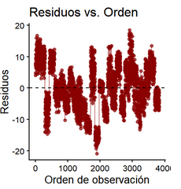
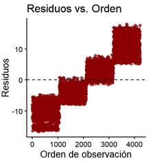

## Introducción

En este trabajo, vamos a procesar un dataset acerca del Parkinson. En el
dataset, se guardan los datos de `42` personas de los Estados Unidos de
América, con la enfermedad de Parkinson en etapas prontías, en un total
de 6 centros médicos. Hay alrededor de `200` mediciones de cada
paciente, para un total de `5875` mediciones. Específicamente, lo que se
hace en cada medición es guardar datos de la voz de los pacientes.

El objetivo principal de los datos es poder predecir `motor_UPDRS` o
`total_UDPRS` a partir de las otras `16` variables. Hay un total de `19`
variables, teniendo en cuenta que una de ellas es la ID del paciente.

## Librerías

```{r warnings=FALSE, message=FALSE}
library(dplyr)
library(ggplot2)
library(stats)
library(gridExtra)
library(reshape2)
library(GGally)
library(summarytools)
library(ggbeeswarm)
library(nortest)
library(infotheo)
#library(YEAB) puede que la volvamos a usar
library(MASS)
library(car)
library(glmnet)
library(mgcv)
library(pscl)
library(caret)
library(pROC)
```

## Lectura y Descripción de Datos

### Lectura de Datos

```{r}
nombres_columnas <- c(
  "subject", "age", "sex", "test_time", "motor_UPDRS", "total_UPDRS", 
  "jitter_pct", "jitter_abs", "jitter_rap", "jitter_ppq5", "jitter_ddp",
  "shimmer", "shimmer_db", "shimmer_apq3", "shimmer_apq5", "shimmer_apq11", "shimmer_dda",
  "nhr", "hnr", "rpde", "dfa", "ppe"
)
parkinson_df <- read.csv("parkinsons_updrs.data", header = TRUE, col.names = nombres_columnas)
```

### Descripción de Datos

En esta tabla, se explicarán cada una de las variables.

| Columha | Descripción | Observación |
|------------------------|------------------------|------------------------|
| `subject#` | Entero que identifica a cada paciente. | Del 1 al 42. |
| `age` | Edad del paciente, en años enteros. |  |
| `sex` | Sexo del paciente, booleano. | "0" es hombre, "1" es mujer. 28 hombres y 14 mujeres según la web. |
| `test_time` | Tiempo desde que se toman datos del sujeto, en días. | Parece que hay valores en negativo, habrá que cambiarlos si se demuestra que son errores. |
| `motor_UPDRS` | Puntuación UPDRS medida por un médico clínico (Exclusivamente la parte motor). | Interpolada linealmente. |
| `total_UPDRS` | Puntuación UPDRS total medida por un médico clínico. | Interpolada linealmente. |
| `Jitter*` | Medidas acerca de la variación de la frecuencia fundamental de la voz. | Son Jitter(%), Jitter(Abs), Jitter:RAP, Jitter:PPQ5 y Jitter:DDP. En castellano, jitter significa vibrar, temblar. |
| `Shimmer*` | Medidas acerca de la variación en amplitud de la voz. | Son Shimmer, Shimmer(dB), Shimmer:APQ3, Shimmer:APQ5, Shimmer:APQ11 y Shimmer:DDA. En castellano, shimmer significa titilar. |
| `NHR` y `HNR` | Medidas del ratio del sonido a componentes tonales de la voz. | "Noise-to-harmonics" ratio y "harmonics-to-noise" ratio. |
| `RPDE` | Medida no linear dinámica de la complejidad. | Siglas que significan "Recurrence Period Density Entropy". "Cómo de predecible es la voz, sabiendo que con Parkinson se vuelve caótica". |
| `DFA` | Exponente de escalado de señal fractal. | "Detrended Fluctuation Analysis", medida relacionada a señales. "Si lo visto en un instante está correlacionado con el futuro". |
| `PPE` | Medida no lineal de la variación fundamental de la frecuencia. | "Pitch Period Entropy". "Cómo de variable es el tono de la voz". |

UPDRS son las siglas de "Unified Parkinson's Disease Rating Scale". Ya
que este test no se hace todos los días al paciente, existen algunas
observaciones no enteras porque se hace interpolación lineal entre el
test más reciente y el test posterior.

En la descripción de datos del propio dataset también aparecen todos los
`Jitter` y `Shimmer` juntos, con esa misma descripción (no se nos indica
cuál es la diferencia entre las variables).

## Preparación de Datos

### Partición de Datos

Vamos a hacer las particiones, en las cuales vamos a escoger por
cuartiles para evitar que entre partición y partición no se parezcan
nada:

```{r}
set.seed(123)

# añadimos id temporal y cuartiles
df_base <- parkinson_df 
df_listo <- df_base %>%
  mutate(
    temp_row_id = row_number(),
    cuartil = ntile(motor_UPDRS, 4)
  )

# train es 72%
train_final <- df_listo %>%
  group_by(cuartil) %>%
  slice_sample(prop = 0.72) %>%
  ungroup()

# guardo los restantes...
restantes <- df_listo %>%
  filter(!(temp_row_id %in% train_final$temp_row_id))

# ... que son 50% test y 50% val
test_final <- restantes %>%
  group_by(cuartil) %>%
  slice_sample(prop = 0.50) %>%
  ungroup()

val_final <- restantes %>%
  filter(!(temp_row_id %in% test_final$temp_row_id))

# quitamos las variables temporales
train_final <- train_final %>% dplyr::select(-cuartil, -temp_row_id)
test_final  <- test_final  %>% dplyr::select(-cuartil, -temp_row_id)
val_final   <- val_final   %>% dplyr::select(-cuartil, -temp_row_id)

cat("Train:", nrow(train_final), "filas\n")
cat("Test: ", nrow(test_final), "filas\n")
cat("Val:  ", nrow(val_final), "filas\n")
```

#### Por qué no estamos haciendo la partición con los sujetos

Antes de llegar a la sección de [Modelos no Lineales y Transformación de
Variables], se decidió cambiar la partición a esta, siendo que antes
usábamos una partición que escogía sujetos. El motivo por el cuál hemos
cambiado es simple: las particiones tenían un parecido bajísimo (entre
train, test y val) y, al no estar mezclados los datos se podía ver en la
gráfica de Residuos vs. Orden que se seguía un patrón.



El código de la antigua partición es el siguiente (comentado, ya que no
nos interesan los resultados):

```{r}
# mediante una semilla conseguimos que el ejercicio sea reproducible
#set.seed(123)

# Asignar cuartil a cada sujeto según su motor_UPDRS medio
#sujetos_stats <- parkinson_df %>%
#  group_by(subject) %>%
#  summarise(mean_updrs = mean(motor_UPDRS)) %>%
#  mutate(cuartil = ntile(mean_updrs, 4))

# Tomar sujetos de cada cuartil proporcionalmente
#train_sujetos <- sujetos_stats %>%
#  group_by(cuartil) %>%
#  slice_sample(prop = 0.72) %>%
#  pull(subject)

#restantes <- sujetos_stats %>%
#  filter(!subject %in% train_sujetos)

#test_sujetos <- restantes %>%
#  group_by(cuartil) %>%
#  slice_sample(prop = 0.5) %>%
#  pull(subject)

#val_sujetos <- restantes %>%
#  filter(!subject %in% test_sujetos) %>%
#  pull(subject)

#train_sucio <- subset(parkinson_df, subject %in% train_sujetos)
#test_sucio <- subset(parkinson_df, subject %in% test_sujetos)
#val_sucio <- subset(parkinson_df, subject %in% val_sujetos)

#summary(train_sucio$motor_UPDRS)
#summary(test_sucio$motor_UPDRS)
#summary(val_sucio$motor_UPDRS)
```

Resulta que más tarde particionamos de nuevo así para comprobar unas
cosas, se volverá a poner este código más abajo.

Además, se han de mezclar los resultados de la partición para que así no
queden los residuos de esta forma. Vamos a hacerlo en la siguiente
sección.



### Limpieza de Datos

Todo se hace a partir de ahora sobre train. Puede que haya errores en
las otras particiones.

`subject` es una variable que no vamos a usar para predecir, debido a
que es una ID. No la vamos a borrar (gracias a que los datos que nos van
a llegar van a tener un paciente asociado también).

Podemos usar `subject` para saber si hay alguna medición extraña
paciente a paciente (de repente cambia de edad más de un año, cambia de
sexo, etcétera....)

```{r}
train_final %>% count(subject, sex, age, sort=TRUE)
```

Hay 42 filas, mismo número que el de sujetos. Se puede ver que no hay
nada extraño, no hay ningún caso en el cual haya un paciente que haya
sido marcado con dos sexos. Además, son siempre marcados con la misma
edad (es improbable que ninguno haya cumplido años durante la duración
de las pruebas, pero bueno).

`test_time` tiene valores negativos. Además. es la única variable con
valores negativos del dataset. Teniendo en cuenta lo que esta variable
significa, vamos a quitarlos (y ya de paso mezclamos durante el proceso
los datos).

```{r}
sapply(train_final, function(x) sum(is.na(x)))
train_na <- train_final                 
train_na[train_na < 0] <- NA  # como no hay NA entonces puedo convertirlos y borrarlos

train_na2 <- train_na[sample(nrow(train_na)),] #ordenamos al azar
train <- na.omit(train_na2)
head(sort(train$test_time)) # ya no hay valores negativos, solo ceros
```

```{r}
sapply(test_final, function(x) sum(is.na(x)))
test_na <- test_final                
test_na[test_na < 0] <- NA  # como no hay NA entonces puedo convertirlos y borrarlos

test_na2 <- test_na[sample(nrow(test_na)),] # ordenamos al azar
test <- na.omit(test_na2)
head(sort(test$test_time)) # ya no hay valores negativos, solo ceros
```

```{r}
sapply(val_final, function(x) sum(is.na(x)))
val_na <- val_final                 
val_na[val_na < 0] <- NA  # como no hay NA entonces puedo convertirlos y borrarlos

val_na2 <- val_na[sample(nrow(val_na)),] # ordenamos al azar
val <- na.omit(val_na2)
head(sort(val$test_time)) # ya no hay valores negativos, solo ceros
# en este no aparecen ni ceros, jej
```

------------------------------------------------------------------------

## Exploración de Datos

Para explorar todo al mismo tiempo, usaremos muchos histogramas al mismo
tiempo. No haremos histogramas del sexo, la ID y la edad porque no es
lógico hacerlo. Eso sí, se explorarán el sexo y la edad más adelante.

```{r message=FALSE, fig.height=30, fig.width=8}

media_test_time <- mean(train$test_time)
media_motor_UPDRS <- mean(train$motor_UPDRS)
media_total_UPDRS <- mean(train$total_UPDRS)
media_jitter_pct <- mean(train$jitter_pct)
media_jitter_abs <- mean(train$jitter_abs)
media_jitter_rap <- mean(train$jitter_rap)
media_jitter_ppq5 <- mean(train$jitter_ppq5)
media_jitter_ddp <- mean(train$jitter_ddp)
media_shimmer <- mean(train$shimmer)
media_shimmer_db <- mean(train$shimmer_db)
media_shimmer_apq3 <- mean(train$shimmer_apq3)
media_shimmer_apq5 <- mean(train$shimmer_apq5)
media_shimmer_apq11 <- mean(train$shimmer_apq11)
media_shimmer_dda <- mean(train$shimmer_dda)
media_nhr <- mean(train$nhr)
media_hnr <- mean(train$hnr)
media_rpde <- mean(train$rpde)
media_dfa <- mean(train$dfa)
media_ppe <- mean(train$ppe)

hist1 <- ggplot(data = train, mapping = aes(x = .data[["test_time"]])) + #datos
  geom_histogram() + #histograma, dependiendo de la variable pondré otro valor de bins
  geom_vline(xintercept = media_test_time, color = "red", linetype = "dashed", linewidth = 1) + #línea roja
  labs(title = "Distribución de test_time", x = "Cantidad de días", y = "Frecuencia" ) + #leyenda
  theme_minimal() #tema

hist2 <- ggplot(data = train, mapping = aes(x = .data[["motor_UPDRS"]])) + #datos
  geom_histogram() + #histograma, dependiendo de la variable pondré otro valor de bins
  geom_vline(xintercept = media_motor_UPDRS, color = "red", linetype = "dashed", linewidth = 1) + #línea roja
  labs(title = "Distribución de motor_UPDRS", x = "Puntuación", y = "Frecuencia" ) + #leyenda
  theme_minimal() #tema

hist3 <- ggplot(data = train, mapping = aes(x = .data[["total_UPDRS"]])) + #datos
  geom_histogram() + #histograma, dependiendo de la variable pondré otro valor de bins
  geom_vline(xintercept = media_total_UPDRS, color = "red", linetype = "dashed", linewidth = 1) + #línea roja
  labs(title = "Distribución de total_UPDRS", x = "Puntuación", y = "Frecuencia" ) + #leyenda
  theme_minimal() #tema

hist4 <- ggplot(data = train, mapping = aes(x = .data[["jitter_pct"]])) + #datos
  geom_histogram() + #histograma, dependiendo de la variable pondré otro valor de bins
  geom_vline(xintercept = media_jitter_pct, color = "red", linetype = "dashed", linewidth = 1) + #línea roja
  labs(title = "Distribución de jitter_pct", x = "Cantidad", y = "Frecuencia" ) + #leyenda
  theme_minimal() #tema

hist5 <- ggplot(data = train, mapping = aes(x = .data[["jitter_abs"]])) + #datos
  geom_histogram() + #histograma, dependiendo de la variable pondré otro valor de bins
  geom_vline(xintercept = media_jitter_abs, color = "red", linetype = "dashed", linewidth = 1) + #línea roja
  labs(title = "Distribución de jitter_abs", x = "Cantidad", y = "Frecuencia" ) + #leyenda
  theme_minimal() #tema

hist6 <- ggplot(data = train, mapping = aes(x = .data[["jitter_rap"]])) + #datos
  geom_histogram() + #histograma, dependiendo de la variable pondré otro valor de bins
  geom_vline(xintercept = media_jitter_rap, color = "red", linetype = "dashed", linewidth = 1) + #línea roja
  labs(title = "Distribución de jitter_rap", x = "Cantidad", y = "Frecuencia" ) + #leyenda
  theme_minimal() #tema

hist7 <- ggplot(data = train, mapping = aes(x = .data[["jitter_ppq5"]])) + #datos
  geom_histogram() + #histograma, dependiendo de la variable pondré otro valor de bins
  geom_vline(xintercept = media_jitter_ppq5, color = "red", linetype = "dashed", linewidth = 1) + #línea roja
  labs(title = "Distribución de jitter_ppq5", x = "Cantidad", y = "Frecuencia" ) + #leyenda
  theme_minimal() #tema

hist8 <- ggplot(data = train, mapping = aes(x = .data[["jitter_ddp"]])) + #datos
  geom_histogram() + #histograma, dependiendo de la variable pondré otro valor de bins
  geom_vline(xintercept = media_jitter_ddp, color = "red", linetype = "dashed", linewidth = 1) + #línea roja
  labs(title = "Distribución de jitter_ddp", x = "Cantidad", y = "Frecuencia" ) + #leyenda
  theme_minimal() #tema

hist9 <- ggplot(data = train, mapping = aes(x = .data[["shimmer"]])) + #datos
  geom_histogram() + #histograma, dependiendo de la variable pondré otro valor de bins
  geom_vline(xintercept = media_shimmer, color = "red", linetype = "dashed", linewidth = 1) + #línea roja
  labs(title = "Distribución de shimmer", x = "Cantidad", y = "Frecuencia" ) + #leyenda
  theme_minimal() #tema

hist10 <- ggplot(data = train, mapping = aes(x = .data[["shimmer_db"]])) + #datos
  geom_histogram() + #histograma, dependiendo de la variable pondré otro valor de bins
  geom_vline(xintercept = media_shimmer_db, color = "red", linetype = "dashed", linewidth = 1) + #línea roja
  labs(title = "Distribución de shimmer_db", x = "Cantidad", y = "Frecuencia" ) + #leyenda
  theme_minimal() #tema

hist11 <- ggplot(data = train, mapping = aes(x = .data[["shimmer_apq3"]])) + #datos
  geom_histogram() + #histograma, dependiendo de la variable pondré otro valor de bins
  geom_vline(xintercept = media_shimmer_apq3, color = "red", linetype = "dashed", linewidth = 1) + #línea roja
  labs(title = "Distribución de shimmer_apq3", x = "Cantidad", y = "Frecuencia" ) + #leyenda
  theme_minimal() #tema

hist12 <- ggplot(data = train, mapping = aes(x = .data[["shimmer_apq5"]])) + #datos
  geom_histogram() + #histograma, dependiendo de la variable pondré otro valor de bins
  geom_vline(xintercept = media_shimmer_apq5, color = "red", linetype = "dashed", linewidth = 1) + #línea roja
  labs(title = "Distribución de shimmer_apq5", x = "Cantidad", y = "Frecuencia" ) + #leyenda
  theme_minimal() #tema

hist13 <- ggplot(data = train, mapping = aes(x = .data[["shimmer_apq11"]])) + #datos
  geom_histogram() + #histograma, dependiendo de la variable pondré otro valor de bins
  geom_vline(xintercept = media_shimmer_apq11, color = "red", linetype = "dashed", linewidth = 1) + #línea roja
  labs(title = "Distribución de shimmer_apq11", x = "Cantidad", y = "Frecuencia" ) + #leyenda
  theme_minimal() #tema

hist14 <- ggplot(data = train, mapping = aes(x = .data[["shimmer_dda"]])) + #datos
  geom_histogram() + #histograma, dependiendo de la variable pondré otro valor de bins
  geom_vline(xintercept = media_shimmer_dda, color = "red", linetype = "dashed", linewidth = 1) + #línea roja
  labs(title = "Distribución de shimmer_dda", x = "Cantidad", y = "Frecuencia" ) + #leyenda
  theme_minimal() #tema

hist15 <- ggplot(data = train, mapping = aes(x = .data[["nhr"]])) + #datos
  geom_histogram() + #histograma, dependiendo de la variable pondré otro valor de bins
  geom_vline(xintercept = media_nhr, color = "red", linetype = "dashed", linewidth = 1) + #línea roja
  labs(title = "Distribución de nhr", x = "Cantidad", y = "Frecuencia" ) + #leyenda
  theme_minimal() #tema

hist16 <- ggplot(data = train, mapping = aes(x = .data[["hnr"]])) + #datos
  geom_histogram() + #histograma, dependiendo de la variable pondré otro valor de bins
  geom_vline(xintercept = media_hnr, color = "red", linetype = "dashed", linewidth = 1) + #línea roja
  labs(title = "Distribución de hnr", x = "Cantidad", y = "Frecuencia" ) + #leyenda
  theme_minimal() #tema

hist17 <- ggplot(data = train, mapping = aes(x = .data[["rpde"]])) + #datos
  geom_histogram() + #histograma, dependiendo de la variable pondré otro valor de bins
  geom_vline(xintercept = media_rpde, color = "red", linetype = "dashed", linewidth = 1) + #línea roja
  labs(title = "Distribución de rpde", x = "Cantidad", y = "Frecuencia" ) + #leyenda
  theme_minimal() #tema

hist18 <- ggplot(data = train, mapping = aes(x = .data[["dfa"]])) + #datos
  geom_histogram() + #histograma, dependiendo de la variable pondré otro valor de bins
  geom_vline(xintercept = media_dfa, color = "red", linetype = "dashed", linewidth = 1) + #línea roja
  labs(title = "Distribución de dfa", x = "Cantidad", y = "Frecuencia" ) + #leyenda
  theme_minimal() #tema

hist19 <- ggplot(data = train, mapping = aes(x = .data[["ppe"]])) + #datos
  geom_histogram() + #histograma, dependiendo de la variable pondré otro valor de bins
  geom_vline(xintercept = media_ppe, color = "red", linetype = "dashed", linewidth = 1) + #línea roja
  labs(title = "Distribución de ppe", x = "Cantidad", y = "Frecuencia" ) + #leyenda
  theme_minimal() #tema


grid.arrange(hist1, hist2, hist3, hist4, hist5, hist6, hist7, hist8, hist9, hist10, hist11, hist12, hist13, hist14, hist15, hist16, hist17, hist18, hist19, nrow=10)
```

Además de los histogramas, con la siguiente tabla se puede ver más
información importante:

```{r}
# tabla de valores interesantes de descr
# nos entrega información de todas las variables excepto las tres que se quitan
# transpose y headings son tocados para hacer que los datos aparezcan más limpios, stats son los datos que más importa mostrar ahora
train_descr <- train |> dplyr::select(-subject,-age, -sex)
descr(train_descr, stats = c("mean", "sd", "skewness", "kurtosis", "min", "max"), transpose = TRUE, headings= FALSE)
```

Así de primeras, se pueden ver claramente dos grandes grupos de
variables: los `jitter*` y los `shimmer*`. Cada uno de los integrantes
del grupo es muy similar al resto, a excepción de `jitter_abs`. Vamos a
actuar como si los grupos fuesen una sola variable, y si algo raro es
visible en alguna de las variables se mencionará ahí. Se explorará como
si fuese un grupo también las dos variables de `*_UPDRS`. Ya que `nhr` y
`hnr` aparecen juntas en la tabla de descripción de variables, también
las juntaré aquí.

En la tabla de valores interesantes, se puede ver que algunos valores de
skewness y kurtosis coinciden, lo cual es señal de posibles variables
duplicadas. Veremos si esto es cierto. Viendo los valores de skewness y
kurtosis, descubrimos que `rpde` tal vez sea normal.

### test_time

Parece una uniforme que se extiende desde el 0 hasta casi 200, a veces
extendiéndose un poco más. Teniendo en cuenta que esta variable indica
el día desde el comienzo del monitoreo del paciente, tiene sentido que
sea uniforme hasta el final, donde muestra algo de cola: todos los
pacientes tienen un día 0 pero no todos terminan al mismo tiempo las
pruebas. Destaca un "hueco" en la mitad (algo antes del 100) del
histograma, que habrá que investigar. Pruebo un valor distinto de
binwidth:

```{r}
ggplot(data = train, mapping = aes(x = .data[["test_time"]])) + #datos
  geom_histogram(bins=50) + #histograma, dependiendo de la variable pondré otro valor de bins
  geom_vline(xintercept = media_test_time, color = "red", linetype = "dashed", linewidth = 1) + #línea roja
  labs(title = "Distribución de test_time", x = "Cantidad de días", y = "Frecuencia" ) + #leyenda
  theme_minimal() #tema
```

Se puede ver que el hueco sigue existiendo. Esto puede ser causado por
algo de la vida real. Al caer la línea en el hueco, se podría suponer
que algunos pacientes devolvieron temporalmente el medidor a petición
del médico, para guardar los datos ya medidos, por ejemplo. También
podemos ver con esto que no todos los días se toman mediciones.

Una de las conclusiones que sacamos antes de cambiar la partición fue
que los pacientes hacían con un orden bastante irregular las mediciones
(un sujeto medía al principio una vez a la semana, luego empezó a
acelerar el ritmo de mediciones). Eso sí, todos los sujetos tenían
asociados unas más de 100 mediciones igualmente.

En conclusión, era de esperar que no fuese una variable uniforme exacta
gracias a que no todos los pacientes entregaron la misma cantidad de
datos ni se hicieron las pruebas los mismos días, y destaca el pequeño
hueco que hay en la mitad de la distribución.

### motor_UPDRS y total_UPDRS

Algo a tener en cuenta cuando exploremos estas variables es que el
dataset es de 2009, es muy probable que haya cambiado bastante el test
UPDRS. Sin embargo, la idea del test es la misma: saber cuánto afecta al
paciente la enfermedad de Parkinson. Ya que nuestras variables solamente
hablan acerca de efectos físicos de la enfermedad, una vez vayamos a
decidir cuál de las dos variables vamos a predecir escogeremos
`motor_UPDRS`.

Las distribuciones de los dos valores son raras, y no son parecidas
entre sí. Sin embargo, han de tener relación, aunque no sepamos cuánta
aún. Hagamos un par de operaciones para ver cómo de relacionadas están.

Restemos y también dividamos el uno al otro para así ver si son
separados por cantidades similares, y si influye siempre lo mismo el
valor de `motor_UPDRS` en el total:

```{r message=FALSE}
updrs_diff <- train$total_UPDRS - train$motor_UPDRS
ud_df <- data.frame(updrs_diff)
ggplot(data = ud_df, mapping = aes(x = .data[["updrs_diff"]])) + 
  geom_histogram() +
  labs(title = "total_UPDRS - motor_UPDRS") +
  theme_minimal() 
summary(updrs_diff)
updrs_ratio <- train$motor_UPDRS / train$total_UPDRS
ur_df <- data.frame(updrs_ratio)
ggplot(data = ur_df, mapping = aes(x = .data[["updrs_ratio"]])) +
  geom_histogram() +
  labs(title = "total_UPDRS / motor_UPDRS") +
  theme_minimal() 
summary(updrs_ratio)
```

Algunos pacientes se ven más afectados que otros por sus problemas
motores (es lo que indica el ratio) y la diferencia nos indica que no
suele aumentar lo mismo el total, por lo tanto estas dos variables no
tienen una correlación enorme.

Con la anterior partición investigamos a un sujeto (25) el cual tenía
constantemente un `updrs_diff` de 20, muy separado del resto y sin
entregar indicios de por qué tenía un valor tan elevado en comparación a
otros sujetos que tienen un `motor_UPDRS` similar.

Usando este sujeto como ejemplo, podemos confirmar que escogeremos
`motor_UPDRS` como variable a predecir, ya que `total_UPDRS` es menos
predecible gracias a la posibilidad de que existan más sujetos como él.
También se puede usar como argumento el segundo histograma, que ocupa un
rango enorme (de más o menos 0.4 hasta casi 1, sin que podamos saber qué
lo causa con nuestros datos).

Veamos la correlación entre ambos valores, simplemente para ver cómo de
elevada es:

```{r}
updrs <- scale(train[ ,5:6]) # son la quinta y sexta columna
cor(x = updrs)[2] #que muestre solamente el valor importante
```

### jitter\*

Estandarizamos para comparar:

```{r message=FALSE}
jitter_escalado <- scale(train[ ,7:11]) #jitter* de 7 a 11
jitter_melt <- melt(jitter_escalado) # permite que pueda hacer la representación

ggplot(data = jitter_melt, mapping = aes(x = Var2, y = value)) + geom_boxplot()
```

`jitter_abs` es distinto a los demás, como mencionamos antes, pero el
resto son muy similares después de estandarizar (muchos valores lejanos
a la cola superior del boxplot, caja de más o menos el mismo tamaño). La
caja de `jitter_abs` es algo más ancha y tiene los valores "atípicos"
bastante más cerca del 0.

Veamos si son log-normales:

```{r message=FALSE}
logjitter_pct <- log(train$jitter_pct)
ggplot(mapping = aes(logjitter_pct)) + geom_histogram() + labs(title = "Logaritmo de jitter_pct (no parece normal)")
# no se parece, así que no voy a hacer más tests
logjitter_abs <- log(train$jitter_abs)
ggplot(mapping = aes(logjitter_abs)) + geom_histogram() + labs(title = "Logaritmo de jitter_abs (podría ser normal)")
# voy a hacer unos tests
descr(logjitter_abs, stats = c("skewness", "kurtosis"), transpose = TRUE, headings= FALSE)
shapiro.test(logjitter_abs)
lillie.test(logjitter_abs)
```

En el caso de `jitter_pct` vemos que no lo es (mucho peso a la
izquierda), sin embargo `jitter_abs` tiene una forma mucho más cercana a
la normal. Usando skewness y kurtosis (que en este paquete han de ser 0
para denotar normalidad) se puede ver que está cerca de ser normal. Sin
embargo, los tests indican que la distribución no es normal, al ser el
p-valor menor a 0.05.

Veamos las correlaciones:

```{r}
ggcorr(data = jitter_escalado, method = c("everything", "pearson"), label = TRUE, label_round = 3) # pearson es el default, label y label_round se usan para hacer que aparezcan los valores de la correlación con (en este caso) 3 decimales.
```

Se ve una correlación muy alta en todos excepto en los que se involucra
`jitter_abs`. Otra vez, el valor más diferente es este.

Se ve un 1 entre `jitter_rap` y `jitter_ddp`, una de las dos ha de ser
borrada después. Puede que tengamos que borrar más, al estar alguna
correlación más muy cerca del 1.

### shimmer\*

Estandarizamos para comparar:

```{r}
shimmer_escalado <- scale(train[ ,12:17]) #shimmer* de 12 a 17
shimmer_melt <- melt(shimmer_escalado) # permite que pueda hacer la representación

ggplot(data = shimmer_melt, mapping = aes(x = Var2, y = value)) + geom_boxplot()
```

Estos seis son muy similares. Tienen una forma muy similar a la de
`jitter_abs`, al menos mirando a la tabla de histogramas y al boxplot
(en estos boxplots y en el de `jitter_abs`, hay valores atípicos hasta
el valor 10 y la caja es algo más ancha que en el resto de jitters).

Veamos también aquí si son log-normales:

```{r message=FALSE}
logshimmer <- log(train$shimmer)
ggplot(mapping = aes(logshimmer)) + geom_histogram() + labs(title = "Logaritmo de shimmer (cola derecha demasiado fuerte, campana muy puntiaguda)")
# voy a hacer un test más
descr(logshimmer, stats = c("skewness", "kurtosis"), transpose = TRUE, headings= FALSE)
```

En este caso, es más claro que `shimmer` no es log-normal, al tener una
cola derecha con tantas observaciones. El test lo indica: skewness=0.64
indica que hay mucha cola derecha y kurtosis=1.08 indica que la
distribución es más puntiaguda que una normal.

Veamos las correlaciones:

```{r}
ggcorr(data = shimmer_escalado, method = c("everything", "pearson"), label = TRUE, label_round = 3, hjust = 0.7, size = 4, layout.exp = 2)
# hjust, size y layout.exp son usados para que los nombres de las variables se vean bien, vuelven a usarse abajo
```

Hay números muy cercanos a 1 en todos, el más diferente es
`shimmer_apq11`. No es muy extraño, eso sí.

De nuevo, hay otro 1, entre `shimmer_apq3` y `shimmer_dda`. Es seguro
que uno de los dos será eliminado después, pero no serán los únicos que
podrían ser eliminados gracias a que la correlación entre todos es
altísima.

Vamos a juntar tanto `jitter*` como `shimmer*` por investigar:

```{r}
ambos_escalados <- scale(train[ ,7:17])
ggcorr(data = ambos_escalados, method = c("everything", "pearson"), label = TRUE, label_round = 2, hjust = 0.85, size = 4, layout.exp = 3)
```

A pesar de que las distribuciones de `jitter_abs` y `shimmer*` se
parezcan, no existe ninguna correlación fuerte entre ellas. Más bien, se
puede ver que tiene la correlación más baja de todos los `jitter*` con
los `shimmer*`. Evidentemente, no tiene que existir una correlación por
mucho que se parezcan las distribuciones, pero si existiese entonces
podríamos hablar de información interesante.

Y por último, usemos Kolmogorov-Smirnov para ver si la distribución
entre el jitter anómalo y un shimmer es igual:

```{r}
ks.test(ambos_escalados[ ,2], ambos_escalados[ ,6], exact = TRUE) #test entre jitter_abs y shimmer, el exact es para evitar que haya un warning
```

Al ser el p-valor menor que 0.05, podemos confirmar que no existe ni una
correlación especial (con lo de arriba) ni siguen la misma distribución
`jitter_abs` y `shimmer`.

### nhr y hnr

La distribución de la segunda variable tiene forma de campana con una
gran cola izquierda, y la de la primera sigue una distribución que a
primera vista se parece a las de `shimmer` pero con menos outliers.

Veamos la correlación entre las dos:

```{r}
cor(scale(train[ ,18:19]))[2]
```

A pesar de que estén muy relacionadas por sus nombres
(noise-to-harmonics y harmonics-to-noise), la correlación inversa no es
tan fuerte como la de las variables de arriba. Son también distintas en
los valores: `nhr` está entre 0 y 0.75 y `hnr` está entre \~1 y \~35.

### rpde

Al ojo, esta variable tiene una forma extraña, en la cual la frecuencia
va subiendo "en escalones" por la izquierda hasta el pico, donde cae
rápidamente y termina formando una cola derecha con muy pocas
observaciones.

Vimos arriba que esta variable (según la skewness y la kurtosis) podía
ser normal, así que vamos a hacer un test para comprobarlo:

```{r}
# escogemos usar lillie test ya que shapiro wilk empeora cuando hay muchas observaciones
lillie.test(train$rpde)
```

No lo es. Por mucho que los valores sean bastante cercanos a 0, no es
normal debido a que la forma es bastante extraña.

### dfa

Esta distribución es bastante interesante: se muestran dos
acumulaciones/montañas en vez de una como en el resto de las
distribuciones de este tipo. Veámosla con más bins:

```{r}
ggplot(data = train, mapping = aes(x = .data[["dfa"]])) + #datos
  geom_histogram(bins = 50) + #histograma con bins cambiados
  geom_vline(xintercept = media_dfa, color = "red", linetype = "dashed", linewidth = 1) + #línea roja
  labs(title = "Distribución de dfa", x = "Cantidad", y = "Frecuencia" ) + #leyenda
  theme_minimal() #tema
```

Se puede ver aquí también el valle entre las dos concentraciones de
valores.

Hay un (o un par) valor atípico que también aparecía en el anterior
histograma. Vamos a ver cuál es, para investigarlo:

```{r}
# desde View() se puede comprobar que es la observación nº1234 (jej)
print(train[1234,])
print(train[1234, 14:22]) # para mostrar las variables que faltan
```

Es solamente uno. Curiosamente, a pesar de que otras observaciones con
valores altos en `dfa` no tienen un `ppe` muy extraño, esta tiene
también el `ppe` más alto de la partición. En general, los otros valores
son bastante elevados, así que podemos descartar la idea de que esta
observación es un una medición incorrecta.

### ppe

Esta podría ser log-normal.

```{r message=FALSE, warning=FALSE}
ggplot(data = train, mapping = aes(x = log(.data[["ppe"]]))) + 
  geom_histogram()
lillie.test(log(train$ppe)) #test que funciona mejor que el ks.test
descr(log(train$ppe), stats = c("skewness", "kurtosis"), transpose = TRUE, headings= FALSE)
```

Según el test, no lo es. Esto es debido a la cola izquierda y la forma
demasiado empinada (kurtosis positiva).

### age

Vamos a representar las edades. Primero, tendremos que obtenerlas:

```{r}
edades <- (train %>% count(subject, age))[2]
df_edades <- data.frame(edades)
```

Son pocos sujetos, por lo tanto una pirámide poblacional no quedará
bien. Vamos a probar a hacer un gráfico de enjambre:

```{r}
# gráfico de enjambre
ggplot(df_edades, aes(y=age, x='')) +
  geom_beeswarm()
```

Podemos ver dos grandes atípicos: alguien mayor de 80 años y alguien
menor de 40. Las demás observaciones están entre \~75 y \~50, y hay
varias edades que están repetidas.

### sex

El sexo de los pacientes según la página web es 28 hombres y 14 mujeres.

```{r}
# fabricando un dataset nuevo para que me resulte más cómodo
df <- data.frame(
  sexo = c("0", "1"), 
  y = c(28, 14)
)
ggplot(df, aes(sexo, y, fill=sexo)) + labs(sexo = NULL, y = NULL) + geom_bar(stat = "identity") + scale_fill_manual(values=c("blue","pink")) + ggtitle("Sexo de los pacientes")
```

Según [este paper](https://pmc.ncbi.nlm.nih.gov/articles/PMC11885646/),
el riesgo de Parkinson es 1.5 veces mayor en hombres, haciendo así que
la población general afectada por el Parkinson no se vea representada
correctamente. Si nuestro modelo fuese implementado en la vida real,
tendría sesgo.

### Relación de las Variables Explicativas con la Objetivo

En esta sección se creará una tabla en la cual se mostrarán datos acerca
de la relación de las variables con `motor_UPDRS`, debido a que de
momento no nos hemos preguntado cuál de las variables es la que más nos
sirve para poder predecirlo.

No vamos a usar las siguientes variables, ya que no tendría sentido:
`test_time`, `total_UPDRS`, `age` y `sex`.

El razonamiento detrás de la exclusión de `test_time` está escrito más
abajo, en la sección de \[PCA o Selección de Variables\]. `total_UPDRS`
es excluida porque no la tendremos a la hora de predecir. `sex` y `age`
son excluidas porque causarían sobreajuste (`age` predice perfectamente
al sujeto de 36 años porque sabe quién es con la edad, sería como
predecir con `subject`, `sex` haría algo similar pero entre los dos
sexos).

```{r}
# esto se hará creando un dataframe e imprimiéndolo
# pearson, spearman, info mutua e info mutua / entropía

# vector de pearson, al ser default no lo especifico
v_pearson <- c(cor(x = train$jitter_pct, y = train$motor_UPDRS),
             cor(x = train$jitter_abs, y = train$motor_UPDRS),
             cor(x = train$jitter_rap, y = train$motor_UPDRS),
             cor(x = train$jitter_ppq5, y = train$motor_UPDRS),
             cor(x = train$jitter_ddp, y = train$motor_UPDRS),
             cor(x = train$shimmer, y = train$motor_UPDRS),
             cor(x = train$shimmer_db, y = train$motor_UPDRS),
             cor(x = train$shimmer_apq3, y = train$motor_UPDRS),
             cor(x = train$shimmer_apq5, y = train$motor_UPDRS),
             cor(x = train$shimmer_apq11, y = train$motor_UPDRS),
             cor(x = train$shimmer_dda, y = train$motor_UPDRS),
             cor(x = train$nhr, y = train$motor_UPDRS),
             cor(x = train$hnr, y = train$motor_UPDRS),
             cor(x = train$rpde, y = train$motor_UPDRS),
             cor(x = train$dfa, y = train$motor_UPDRS),
             cor(x = train$ppe, y = train$motor_UPDRS)
             )
# vector de spearman, con , method="s"
v_spearman <- c(cor(x = train$jitter_pct, y = train$motor_UPDRS, method="s"),
             cor(x = train$jitter_abs, y = train$motor_UPDRS, method="s"),
             cor(x = train$jitter_rap, y = train$motor_UPDRS, method="s"),
             cor(x = train$jitter_ppq5, y = train$motor_UPDRS, method="s"),
             cor(x = train$jitter_ddp, y = train$motor_UPDRS, method="s"),
             cor(x = train$shimmer, y = train$motor_UPDRS, method="s"),
             cor(x = train$shimmer_db, y = train$motor_UPDRS, method="s"),
             cor(x = train$shimmer_apq3, y = train$motor_UPDRS, method="s"),
             cor(x = train$shimmer_apq5, y = train$motor_UPDRS, method="s"),
             cor(x = train$shimmer_apq11, y = train$motor_UPDRS, method="s"),
             cor(x = train$shimmer_dda, y = train$motor_UPDRS, method="s"),
             cor(x = train$nhr, y = train$motor_UPDRS, method="s"),
             cor(x = train$hnr, y = train$motor_UPDRS, method="s"),
             cor(x = train$rpde, y = train$motor_UPDRS, method="s"),
             cor(x = train$dfa, y = train$motor_UPDRS, method="s"),
             cor(x = train$ppe, y = train$motor_UPDRS, method="s")
             )
# info mutua
v_mutinfo <- c(
  mutinformation(discretize(train$jitter_pct), discretize(train$motor_UPDRS)),
  mutinformation(discretize(train$jitter_abs), discretize(train$motor_UPDRS)),
  mutinformation(discretize(train$jitter_rap), discretize(train$motor_UPDRS)),
  mutinformation(discretize(train$jitter_ppq5), discretize(train$motor_UPDRS)),
  mutinformation(discretize(train$jitter_ddp), discretize(train$motor_UPDRS)),
  mutinformation(discretize(train$shimmer), discretize(train$motor_UPDRS)),
  mutinformation(discretize(train$shimmer_db), discretize(train$motor_UPDRS)),
  mutinformation(discretize(train$shimmer_apq3), discretize(train$motor_UPDRS)),
  mutinformation(discretize(train$shimmer_apq5), discretize(train$motor_UPDRS)),
  mutinformation(discretize(train$shimmer_apq11), discretize(train$motor_UPDRS)),
  mutinformation(discretize(train$shimmer_dda), discretize(train$motor_UPDRS)),
  mutinformation(discretize(train$nhr), discretize(train$motor_UPDRS)),
  mutinformation(discretize(train$hnr), discretize(train$motor_UPDRS)),
  mutinformation(discretize(train$rpde), discretize(train$motor_UPDRS)),
  mutinformation(discretize(train$dfa), discretize(train$motor_UPDRS)),
  mutinformation(discretize(train$ppe), discretize(train$motor_UPDRS))
)

entropia_target <- entropy(discretize(train$motor_UPDRS))

v_nmi <- v_mutinfo / entropia_target


nombres <- c("jitter_pct", "jitter_abs", "jitter_rap", "jitter_ppq5", "jitter_ddp",
             "shimmer", "shimmer_db", "shimmer_apq3", "shimmer_apq5",
             "shimmer_apq11", "shimmer_dda","nhr", "hnr", "rpde", "dfa", "ppe")

# dataframe para imprimirlo como tabla
df <- data.frame(v_pearson, v_spearman, v_mutinfo,v_nmi, row.names = nombres)
df[order(df$v_mutinfo, decreasing = TRUE), ]
```

Parece que las cuatro métricas de la tabla coinciden: una sola variable
no es suficiente para poder predecir. Necesitamos varias de ellas juntas
para obtener un buen resultado.

Si se tuviese que escoger una de las tres, la mejor candidata es `dfa`,
ya que tiene la información mutua más alta. `hnr` tiene mejores
correlaciones, pero tiene una información mutua menor.
`shimmer_apq11`tiene los tres valores solo un poco más bajos que `hnr`
(y tiene correlación directa).

### Conclusiones del EDA

-   `test_time` es más o menos uniforme, excepto por la mitad y el
    final.
-   Vamos a predecir `motor_UPDRS` ya que `total_UPDRS` es bastante
    menos predecible con lo que tenemos.
-   `jitter*` y `shimmer*` forman dos grupos con correlación alta y
    distribuciones similares, en ambos hay una variable que es
    redundante (dos con correlación 1) y `jitter_abs` es distinta a
    todas.
-   Hay varias edades repetidas y solo existen dos atípicos (36 y 85).
-   El ratio de sexo de nuestros pacientes es distinto al de la
    población general (más hombres, puede que cause sesgo).
-   Dos tipos de correlación distintos y la información mutua indican
    que una sola variable no es suficiente para hacer un buen modelo de
    regresión.

------------------------------------------------------------------------

## Aplicación del Modelo de Regresión Lineal Simple

A partir de ahora, momento en el que empezamos a hacer modelos, gracias
a que los supuestos no se van a cumplir casi siempre no se van a seguir
estudiando los gráficos o añadiendo más, lógicamente, para evitar perder
el tiempo.

### Regresión Lineal Simple Directamente

Como hemos podido apreciar en el apartado final del EDA, una sola
característica no tiene la potencia suficiente como para predecir la
severidad del Parkinson. Igualmente, vamos a probar la regresión simple
con la predictora más explicativa a modo ilustrativo.

```{r}
regsimple <- lm(motor_UPDRS ~ dfa, data = train)
summary(regsimple)
ggplot(train) + geom_point(aes(x = dfa, y = motor_UPDRS)) + geom_abline(intercept = 29.479, slope = -12.576, color = "red", lwd = 2)
```

```{r}
predicciones_simple <- predict(regsimple, newdata = test)

# 2. Juntamos la realidad con lo que dijo el modelo
resultados_simple <- data.frame(
  real = test$motor_UPDRS,
  predicho = predicciones_simple
)

# 3. Cálculo del RMSE (Cuánto nos equivocamos en puntos UPDRS)
rmse_simple <- sqrt(mean((resultados_simple$real - resultados_simple$predicho)^2, na.rm = TRUE))

# 4. Cálculo del MAPE (El porcentaje de error)
mape_simple <- mean(abs((resultados_simple$real - resultados_simple$predicho) / resultados_simple$real), na.rm = TRUE) * 100

mae_simple <- mean(abs(resultados_simple$real - resultados_simple$predicho), na.rm = TRUE)

# --- EL VEREDICTO DEL MODELO SIMPLE ---
cat("\n=== ERROR DEL MODELO SIMPLE ===\n")
cat("RMSE:", round(rmse_simple, 4), "puntos UPDRS\n")
cat("La media de UPDRS es : ",mean(test$motor_UPDRS),"puntos UPDRS\n")
cat("Siendo los cuartiles (al principio min y al final el max) : ",summary(test$motor_UPDRS),"\n")
cat("MAE:", round(mae_simple,2),"\n")
cat("MAPE:", round(mape_simple,2),"\n")
```

Por lo que vemos de error esperado podríamos estar tanto en el tercer,
como primer cuartil, no es muy fiable esto obviamente. Hemos escogido
estas métricas, dado que el MAE es el error promedio en absoluto,
bastante interpretable en este caso, el RMSE dado que penaliza los
errores grandes y está en las mismas unidades que el target, vemos que
por eso es mayor que el MAE, dado que ha castigado los errores grandes.

```{r}
residuos_completo <- residuals(regsimple)
valores_ajustados_completo <- fitted(regsimple)
residuos_std <- rstandard(regsimple)
leverage_vals <- hatvalues(regsimple)

leverage_vals <- hatvalues(regsimple)
residuos_stud <- rstudent(regsimple)  # Residuos estudentizados
cook_dist <- cooks.distance(regsimple)

datos_leverage <- data.frame(
  leverage = leverage_vals,
  residuos_stud = residuos_stud,
  cook = cook_dist,
  observacion = 1:length(leverage_vals)
)

# Calcular umbrales
n <- nrow(train)
k <- 1
leverage_threshold <- 2 * (k + 1) / n
cook_threshold <- 4 / (n - k - 1)

# Función para crear curvas de Cook
cook_curve <- function(leverage, cook_value, k) {
  sqrt(cook_value * (k + 1) * (1 - leverage) / leverage)
}

# Crear curvas de Cook para diferentes valores
lev_seq <- seq(0.001, max(leverage_vals) * 1.1, length.out = 100)
cook_05 <- data.frame(
  leverage = lev_seq,
  pos = cook_curve(lev_seq, 0.5, k),
  neg = -cook_curve(lev_seq, 0.5, k)
)
cook_1 <- data.frame(
  leverage = lev_seq,
  pos = cook_curve(lev_seq, 1, k),
  neg = -cook_curve(lev_seq, 1, k)
)


# 1. Gráfico Residuos vs. Valores Ajustados
p1_completo <- ggplot(data.frame(x = valores_ajustados_completo, y = residuos_completo), 
                      aes(x = x, y = y)) +
  geom_point(color = "darkred", alpha = 0.7) +
  geom_hline(yintercept = 0, color = "black", linetype = "dashed") +
  geom_smooth(method = "loess", se = FALSE, color = "black", linewidth = 0.8, formula = y ~ x) +
  labs(title = "Residuos vs. Valores Ajustados", x = "Valores Ajustados", y = "Residuos") +
  theme_classic(base_size = 10)

# 2. Gráfico Q-Q Normal
datos_qq_completo <- data.frame(residuos = residuos_std)

p2_completo <- ggplot(datos_qq_completo, aes(sample = residuos)) +
  geom_qq(color = "darkred", alpha = 0.7) +
  geom_qq_line(color = "black", linetype = "dashed") +
  labs(title = "Normal Q-Q Plot", x = "Cuantiles Teóricos", y = "Cuantiles de la Muestra") +
  theme_classic(base_size = 10)

# 3. Gráfico Scale-Location
p3_completo <- ggplot(data.frame(x = valores_ajustados_completo, 
                                 y = sqrt(abs(residuos_std))), 
                      aes(x = x, y = y)) +
  geom_point(color = "darkred", alpha = 0.7) +
  geom_smooth(method = "loess", se = FALSE, color = "black", linewidth = 0.8, formula = y ~ x) +
  labs(title = "Scale-Location", x = "Valores Ajustados", 
       y = expression(sqrt("|Residuos Estandarizados|"))) +
  theme_classic(base_size = 10)

# 4. Gráfico Residuos vs. Leverage (con curvas de Cook)
p4_completo <- ggplot(datos_leverage, aes(x = leverage, y = residuos_stud)) +
  # Curvas de Cook
  geom_line(data = cook_05, aes(x = leverage, y = pos), 
            color = "black", linetype = "dashed", alpha = 0.6, inherit.aes = FALSE) +
  geom_line(data = cook_05, aes(x = leverage, y = neg), 
            color = "black", linetype = "dashed", alpha = 0.6, inherit.aes = FALSE) +
  geom_line(data = cook_1, aes(x = leverage, y = pos), 
            color = "black", linetype = "solid", alpha = 0.8, inherit.aes = FALSE) +
  geom_line(data = cook_1, aes(x = leverage, y = neg), 
            color = "black", linetype = "solid", alpha = 0.8, inherit.aes = FALSE) +
  # Puntos de datos
  geom_point(color = "darkred", alpha = 0.7, size = 1.5) +
  # Líneas de referencia
  geom_hline(yintercept = 0, color = "gray", linetype = "dashed") +
  geom_hline(yintercept = c(-2, 2), color = "orange", linetype = "dotted", alpha = 0.7) +
  geom_vline(xintercept = leverage_threshold, color = "purple", linetype = "dotted", alpha = 0.7) +
  labs(title = "Residuals vs. Leverage", x = "Leverage", y = "Residuos Estudentizados") +
  theme_classic(base_size = 10)

# 5. Histograma de residuos
p5_completo <- ggplot(data.frame(residuos = residuos_completo), aes(x = residuos)) +
  geom_histogram(aes(y = after_stat(density)), bins = 15, fill = "red", 
                 color = "black", alpha = 0.7) +
  stat_function(fun = dnorm, 
                args = list(mean = mean(residuos_completo), sd = sd(residuos_completo)),
                color = "black", linewidth = 1) +
  labs(title = "Histograma de Residuos", x = "Residuos", y = "Densidad") +
  theme_classic(base_size = 10)

# 6. Residuos vs. Orden
p6_completo <- ggplot(data.frame(orden = 1:length(residuos_completo), 
                                 residuos = residuos_completo), 
                      aes(x = orden, y = residuos)) +
  geom_point(color = "darkred", alpha = 0.7) +
  geom_line(color = "darkred", alpha = 0.5) +
  geom_hline(yintercept = 0, color = "black", linetype = "dashed") +
  labs(title = "Residuos vs. Orden", x = "Orden de observación", y = "Residuos") +
  theme_classic(base_size = 10)

# Mostrar todos los gráficos en una rejilla 2x3
library(gridExtra)
grid.arrange(p1_completo, p2_completo, p3_completo, 
             p4_completo, p5_completo, p6_completo, ncol = 3)
```

Vemos que en el QQ-Plot tiene unas colas muy pesadas y, por mucho que no
se vea, la autocorrelacción es significativa, lo cual es causado porque
tenemos observaciones de una misma persona a lo largo del tiempo. Así
vemos no solo el modelo no tiene capacidad para predecir, sino que
tampoco tiene base matemática ya que viola el supuesto de normalidad de
residuos y el de autocorrelacción.

Este mismo problema de autocorrelacción se desarrollará ahora de cara a
regresión múltiple, modelos no lineales y GLMs.

### Regresión Lineal Simple con Transformación Previa

Puede que una transformación haga que las cosas mejoren, vamos a probar
primero con `dfa`:

```{r}
# boxcox y luego modelo
bdfa <- boxcox(lm(train$dfa ~ 1))
lambdadfa <- bdfa$x[which.max(bdfa$y)]

newdfa <- (train$dfa ^ lambdadfa - 1) / lambdadfa

ggplot(train) + geom_point(aes(x = dfa, y = motor_UPDRS))
ggplot() + geom_point(aes(x = newdfa, y = train$motor_UPDRS))
```

No parece haber cambiado mucho, tan solo se ha extendido un poco la
nube.

Una variable que va a cambiar mucho al ser transformada es
`shimmer_apq11`, la cual era una de mejores variables según el EDA.
Veamos cuánto cambia con la transformación, y luego haremos un modelo:

```{r}
bapq11 <- boxcox(lm(train$shimmer_apq11 ~ 1))
lambdaapq11 <- bapq11$x[which.max(bapq11$y)]

newapq11 <- (train$shimmer_apq11 ^ lambdaapq11 - 1) / lambdaapq11

ggplot(train) + geom_point(aes(x = shimmer_apq11, y = motor_UPDRS))
ggplot() + geom_point(aes(x = newapq11, y = train$motor_UPDRS))
```

Cambia bastante. Ahora veamos cómo queda el modelo:

```{r}
lmapq11 <- lm(train$motor_UPDRS~newapq11)
summary(lmapq11)

ggplot() + geom_point(aes(x = newapq11, y = train$motor_UPDRS)) + geom_abline(intercept = 27.9674, slope = 1.3293, color = "red", lwd = 2)
```

Técnicamente, según la R cuadrado y el estadístico F este modelo debería
de ser mejor (ambos son más altos), pero aún así no parece ser nada
bueno. Estudiemos los residuos:

```{r}
residuos_completo <- residuals(lmapq11)
valores_ajustados_completo <- fitted(lmapq11)
residuos_std <- rstandard(lmapq11)
leverage_vals <- hatvalues(lmapq11)

leverage_vals <- hatvalues(lmapq11)
residuos_stud <- rstudent(lmapq11)  # Residuos estudentizados
cook_dist <- cooks.distance(lmapq11)

datos_leverage <- data.frame(
  leverage = leverage_vals,
  residuos_stud = residuos_stud,
  cook = cook_dist,
  observacion = 1:length(leverage_vals)
)

# Calcular umbrales
n <- nrow(train)
k <- 1
leverage_threshold <- 2 * (k + 1) / n
cook_threshold <- 4 / (n - k - 1)

# Función para crear curvas de Cook
cook_curve <- function(leverage, cook_value, k) {
  sqrt(cook_value * (k + 1) * (1 - leverage) / leverage)
}

# Crear curvas de Cook para diferentes valores
lev_seq <- seq(0.001, max(leverage_vals) * 1.1, length.out = 100)
cook_05 <- data.frame(
  leverage = lev_seq,
  pos = cook_curve(lev_seq, 0.5, k),
  neg = -cook_curve(lev_seq, 0.5, k)
)
cook_1 <- data.frame(
  leverage = lev_seq,
  pos = cook_curve(lev_seq, 1, k),
  neg = -cook_curve(lev_seq, 1, k)
)


# 1. Gráfico Residuos vs. Valores Ajustados
p1_completo <- ggplot(data.frame(x = valores_ajustados_completo, y = residuos_completo), 
                      aes(x = x, y = y)) +
  geom_point(color = "darkred", alpha = 0.7) +
  geom_hline(yintercept = 0, color = "black", linetype = "dashed") +
  geom_smooth(method = "loess", se = FALSE, color = "black", linewidth = 0.8, formula = y ~ x) +
  labs(title = "Residuos vs. Valores Ajustados", x = "Valores Ajustados", y = "Residuos") +
  theme_classic(base_size = 10)

# 2. Gráfico Q-Q Normal
datos_qq_completo <- data.frame(residuos = residuos_std)

p2_completo <- ggplot(datos_qq_completo, aes(sample = residuos)) +
  geom_qq(color = "darkred", alpha = 0.7) +
  geom_qq_line(color = "black", linetype = "dashed") +
  labs(title = "Normal Q-Q Plot", x = "Cuantiles Teóricos", y = "Cuantiles de la Muestra") +
  theme_classic(base_size = 10)

# 3. Gráfico Scale-Location
p3_completo <- ggplot(data.frame(x = valores_ajustados_completo, 
                                 y = sqrt(abs(residuos_std))), 
                      aes(x = x, y = y)) +
  geom_point(color = "darkred", alpha = 0.7) +
  geom_smooth(method = "loess", se = FALSE, color = "black", linewidth = 0.8, formula = y ~ x) +
  labs(title = "Scale-Location", x = "Valores Ajustados", 
       y = expression(sqrt("|Residuos Estandarizados|"))) +
  theme_classic(base_size = 10)

# 4. Gráfico Residuos vs. Leverage (con curvas de Cook)
p4_completo <- ggplot(datos_leverage, aes(x = leverage, y = residuos_stud)) +
  # Curvas de Cook
  geom_line(data = cook_05, aes(x = leverage, y = pos), 
            color = "black", linetype = "dashed", alpha = 0.6, inherit.aes = FALSE) +
  geom_line(data = cook_05, aes(x = leverage, y = neg), 
            color = "black", linetype = "dashed", alpha = 0.6, inherit.aes = FALSE) +
  geom_line(data = cook_1, aes(x = leverage, y = pos), 
            color = "black", linetype = "solid", alpha = 0.8, inherit.aes = FALSE) +
  geom_line(data = cook_1, aes(x = leverage, y = neg), 
            color = "black", linetype = "solid", alpha = 0.8, inherit.aes = FALSE) +
  # Puntos de datos
  geom_point(color = "darkred", alpha = 0.7, size = 1.5) +
  # Líneas de referencia
  geom_hline(yintercept = 0, color = "gray", linetype = "dashed") +
  geom_hline(yintercept = c(-2, 2), color = "orange", linetype = "dotted", alpha = 0.7) +
  geom_vline(xintercept = leverage_threshold, color = "purple", linetype = "dotted", alpha = 0.7) +
  labs(title = "Residuals vs. Leverage", x = "Leverage", y = "Residuos Estudentizados") +
  theme_classic(base_size = 10)

# 5. Histograma de residuos
p5_completo <- ggplot(data.frame(residuos = residuos_completo), aes(x = residuos)) +
  geom_histogram(aes(y = after_stat(density)), bins = 15, fill = "red", 
                 color = "black", alpha = 0.7) +
  stat_function(fun = dnorm, 
                args = list(mean = mean(residuos_completo), sd = sd(residuos_completo)),
                color = "black", linewidth = 1) +
  labs(title = "Histograma de Residuos", x = "Residuos", y = "Densidad") +
  theme_classic(base_size = 10)

# 6. Residuos vs. Orden
p6_completo <- ggplot(data.frame(orden = 1:length(residuos_completo), 
                                 residuos = residuos_completo), 
                      aes(x = orden, y = residuos)) +
  geom_point(color = "darkred", alpha = 0.7) +
  geom_line(color = "darkred", alpha = 0.5) +
  geom_hline(yintercept = 0, color = "black", linetype = "dashed") +
  labs(title = "Residuos vs. Orden", x = "Orden de observación", y = "Residuos") +
  theme_classic(base_size = 10)

# Mostrar todos los gráficos en una rejilla 2x3
library(gridExtra)
grid.arrange(p1_completo, p2_completo, p3_completo, 
             p4_completo, p5_completo, p6_completo, ncol = 3)
```

Como era de esperar, no se cumplen los supuestos.

------------------------------------------------------------------------

## Modelos no Lineales y Transformación de Variables

### Variables que Quitaremos con lo Visto en la Exploración

Se tienen que quitar, con completa seguridad, `jitter_ddp` y
`shimmer_dda`, al tener exactamente 1 de correlación con una variable
previa.

Teniendo en cuenta que en el [paper
original](https://www.nature.com/articles/npre.2009.3920.1) mencionan
que los pacientes no estuvieron medicados durante el estudio, y que los
futuros pacientes en los que se aplicará el modelo podrían estarlo,
`test_time` podría hacer que nuestras estimaciones empeoren. Encima, los
datos futuros podrían no tener esta medida, así que por estas dos
razones vamos a omitir la variable.

Evidentemente, `subject` tendrá que ser quitado en todos los modelos.

### Con Todas las Variables

Dejamos, a partir de ahora, a la explicabilidad de lado y nos vamos a
centrar en predecir.

Vamos a meter todas las variables a lo bruto (incluidas las dos que
íbamos a quitar antes, por si acaso dan más información que las previas)
y vamos a ir reduciendo las variables de forma progresiva. Este primer
modelo será probablemente muy malo.

```{r}
train_selection <- train %>%
  dplyr::select(-subject, -test_time, -total_UPDRS) 

test_selection <- test %>%
 dplyr::select(-subject, -test_time, -total_UPDRS)

val_selection <- val %>%
  dplyr::select(-subject, -test_time, -total_UPDRS)

# con los tres, así no hace falta cambiarlo después
```

```{r}
modelo_multiple <- lm(motor_UPDRS ~ ., data = train_selection)

# 3. DIAGNÓSTICO DE LA EXPLOSIÓN (VIF)
# Si el VIF da error, es que la colinealidad es tan bestia que R no puede ni calcularla.
cat("\n=== ANÁLISIS DE COLINEALIDAD (VIF) ===\n")
tryCatch({
  vif_masacre <- vif(modelo_multiple)
  print(sort(vif_masacre, decreasing = TRUE))
}, error = function(e) {
  cat("ERROR: La multicolinealidad es tan alta que la matriz es singular (VIF incalculable).\n")
})

# 4. PREDICCIONES Y MÉTRICAS EN TEST
pred_masacre <- predict(modelo_multiple, newdata = test_selection)

resultados_masacre <- data.frame(
  real = test_selection$motor_UPDRS,
  predicho = pred_masacre
)

# Cálculo de las 3 métricas sagradas
rmse_masacre <- sqrt(mean((resultados_masacre$real - resultados_masacre$predicho)^2, na.rm = TRUE))
mae_masacre  <- mean(abs(resultados_masacre$real - resultados_masacre$predicho), na.rm = TRUE)
mape_masacre <- mean(abs((resultados_masacre$real - resultados_masacre$predicho) / resultados_masacre$real), na.rm = TRUE) * 100

# --- RESULTADOS POR CONSOLA ---
cat("===ERROR DEL MODELO MÚLTIPLE MASIVO===\n")
cat("RMSE:", round(rmse_masacre, 4), "puntos\n")
cat("MAE: ", round(mae_masacre, 4), "puntos\n")
cat("MAPE:", round(mape_masacre, 2), "%\n")
```

Este modelo, como era de esperar, no tiene buena pinta.

### Stepwise

Vamos a empezar con la selección de variables, usando el criterio de
informacion de Akaike (AIC) de forma stepwise. Como AIC está orientado a
predicción, es mejor que hacerlo con BIC para nosotros.

```{r}
# 1. Ejecutamos el algoritmo Stepwise (Dirección: ambos lados)
# Esto empezará con tu modelo masacre y empezará a quitar basura
modelo_stepwise <- step(modelo_multiple, direction = "both", trace = 1)

# 2. Vemos qué ha quedado vivo
summary(modelo_stepwise)

# 3. COMPROBACIÓN CRÍTICA: ¿Ha bajado el VIF?
cat("\n=== VIF DEL MODELO TRAS SELECCIÓN STEPWISE ===\n")
vif_step <- vif(modelo_stepwise)
print(sort(vif_step, decreasing = TRUE))

# 4. MÉTRICAS DE ERROR EN TEST
pred_step <- predict(modelo_stepwise, newdata = test_selection)
resultados_step <- data.frame(real = test_selection$motor_UPDRS, pred = pred_step)

rmse_step <- sqrt(mean((resultados_step$real - resultados_step$pred)^2, na.rm = TRUE))
mae_step  <- mean(abs(resultados_step$real - resultados_step$pred), na.rm = TRUE)
mape_step <- mean(abs((resultados_step$real - resultados_step$pred) / resultados_step$real), na.rm = TRUE) * 100

cat("\n=== ERROR DEL MODELO SELECCIONADO (STEPWISE) ===\n")
cat("RMSE:", round(rmse_step, 4), "\n")
cat("MAE: ", round(mae_step, 4), "\n")
cat("MAPE:", round(mape_step, 2), "%\n")
```

```{r}
# 1. Ver la estructura final (Variables que sobrevivieron)
cat("\n=== ESTRUCTURA DEL MODELO FINAL (STEPWISE) ===\n")
summary(modelo_stepwise)

# 2. Comprobar la salud del modelo (VIF)
cat("\n=== VIF DEL MODELO FINAL ===\n")
vif_final <- vif(modelo_stepwise)
print(sort(vif_final, decreasing = TRUE))

# 3. Diagnóstico visual de supuestos
cat("\n=== GENERANDO GRÁFICOS DE DIAGNÓSTICO... ===\n")
par(mfrow = c(2, 2)) # Para ver los 4 gráficos a la vez
plot(modelo_stepwise)
```

Podemos ver en estos gráficos un par de veces la observación nº1234, de
la cuál hablamos en el EDA.

### Seleccionando Manualmente Tras Hacer la Stepwise

Vemos que sigue habiendo multicolinealidades muy fuertes, vamos a
hacerlo manualmente enfocándonos primero en eso, ya que esta puede estar
manipulando los p-valores. Vamos a eliminar `shimmer_apq_11` al ser la
de mayor VIF:

```{r}
modmult2 <- lm(formula = motor_UPDRS ~ age + sex + jitter_pct + jitter_abs + 
    jitter_ppq5 + shimmer + shimmer_db + shimmer_apq3 + shimmer_apq5 + 
      nhr + hnr + dfa + ppe, data = train_selection)
summary(modmult2)
vif(modmult2)
```

Podemos observar los VIF disminuyendo aunque sigue quedando trabajo.
Sigamos eliminando variables, en este caso `shimmer`, la cual tiene el
mayor VIF:

```{r}
modmult3 <- lm(formula = motor_UPDRS ~ age + sex + jitter_pct + jitter_abs + 
    jitter_ppq5 + shimmer_db + shimmer_apq3 + shimmer_apq5 + 
      nhr + hnr + dfa + ppe, data = train_selection)
summary(modmult3)
vif(modmult3)
```

Eliminamos manualmente `shimmer_apq5` también:

```{r}
modmult4 <-lm(formula = motor_UPDRS ~ age + sex + jitter_pct + jitter_abs + 
    jitter_ppq5 + shimmer_db + shimmer_apq3 + 
      nhr + hnr + dfa + ppe, data = train_selection)
summary(modmult4)
vif(modmult4)

```

Seguimos, ahora con `jitter_pct`:

```{r}
modmult5 <-lm(formula = motor_UPDRS ~ age + sex + jitter_abs + 
    jitter_ppq5 + shimmer_db + shimmer_apq3 + 
      nhr + hnr + dfa + ppe, data = train_selection)
summary(modmult5)
vif(modmult5)
```

Ahora quitamos `shimmer_db`:

```{r}
modmult6 <-lm(formula = motor_UPDRS ~ age + sex + jitter_abs + 
    jitter_ppq5 + shimmer_apq3 + 
      nhr + hnr + dfa + ppe, data = train_selection)
summary(modmult6)
vif(modmult6)
```

Ya vemos cosas mas normales, por fin. Podemos empezar a trabajar con
esto:

```{r}
residuos_completo <- residuals(modmult6)
valores_ajustados_completo <- fitted(modmult6)
residuos_std <- rstandard(modmult6)
leverage_vals <- hatvalues(modmult6)

leverage_vals <- hatvalues(modmult6)
residuos_stud <- rstudent(modmult6)  # Residuos estudentizados
cook_dist <- cooks.distance(modmult6)

datos_leverage <- data.frame(
  leverage = leverage_vals,
  residuos_stud = residuos_stud,
  cook = cook_dist,
  observacion = 1:length(leverage_vals)
)

# Calcular umbrales
n <- nrow(train)
k <- 9
leverage_threshold <- 2 * (k + 1) / n
cook_threshold <- 4 / (n - k - 1)

# Función para crear curvas de Cook
cook_curve <- function(leverage, cook_value, k) {
  sqrt(cook_value * (k + 1) * (1 - leverage) / leverage)
}

# Crear curvas de Cook para diferentes valores
lev_seq <- seq(0.001, max(leverage_vals) * 1.1, length.out = 100)
cook_05 <- data.frame(
  leverage = lev_seq,
  pos = cook_curve(lev_seq, 0.5, k),
  neg = -cook_curve(lev_seq, 0.5, k)
)
cook_1 <- data.frame(
  leverage = lev_seq,
  pos = cook_curve(lev_seq, 1, k),
  neg = -cook_curve(lev_seq, 1, k)
)


# 1. Gráfico Residuos vs. Valores Ajustados
p1_completo <- ggplot(data.frame(x = valores_ajustados_completo, y = residuos_completo), 
                      aes(x = x, y = y)) +
  geom_point(color = "darkred", alpha = 0.7) +
  geom_hline(yintercept = 0, color = "black", linetype = "dashed") +
  geom_smooth(method = "loess", se = FALSE, color = "black", linewidth = 0.8, formula = y ~ x) +
  labs(title = "Residuos vs. Valores Ajustados", x = "Valores Ajustados", y = "Residuos") +
  theme_classic(base_size = 10)

# 2. Gráfico Q-Q Normal
datos_qq_completo <- data.frame(residuos = residuos_std)

p2_completo <- ggplot(datos_qq_completo, aes(sample = residuos)) +
  geom_qq(color = "darkred", alpha = 0.7) +
  geom_qq_line(color = "black", linetype = "dashed") +
  labs(title = "Normal Q-Q Plot", x = "Cuantiles Teóricos", y = "Cuantiles de la Muestra") +
  theme_classic(base_size = 10)

# 3. Gráfico Scale-Location
p3_completo <- ggplot(data.frame(x = valores_ajustados_completo, 
                                 y = sqrt(abs(residuos_std))), 
                      aes(x = x, y = y)) +
  geom_point(color = "darkred", alpha = 0.7) +
  geom_smooth(method = "loess", se = FALSE, color = "black", linewidth = 0.8, formula = y ~ x) +
  labs(title = "Scale-Location", x = "Valores Ajustados", 
       y = expression(sqrt("|Residuos Estandarizados|"))) +
  theme_classic(base_size = 10)

# 4. Gráfico Residuos vs. Leverage (con curvas de Cook)
p4_completo <- ggplot(datos_leverage, aes(x = leverage, y = residuos_stud)) +
  # Curvas de Cook
  geom_line(data = cook_05, aes(x = leverage, y = pos), 
            color = "black", linetype = "dashed", alpha = 0.6, inherit.aes = FALSE) +
  geom_line(data = cook_05, aes(x = leverage, y = neg), 
            color = "black", linetype = "dashed", alpha = 0.6, inherit.aes = FALSE) +
  geom_line(data = cook_1, aes(x = leverage, y = pos), 
            color = "black", linetype = "solid", alpha = 0.8, inherit.aes = FALSE) +
  geom_line(data = cook_1, aes(x = leverage, y = neg), 
            color = "black", linetype = "solid", alpha = 0.8, inherit.aes = FALSE) +
  # Puntos de datos
  geom_point(color = "darkred", alpha = 0.7, size = 1.5) +
  # Líneas de referencia
  geom_hline(yintercept = 0, color = "gray", linetype = "dashed") +
  geom_hline(yintercept = c(-2, 2), color = "orange", linetype = "dotted", alpha = 0.7) +
  geom_vline(xintercept = leverage_threshold, color = "purple", linetype = "dotted", alpha = 0.7) +
  labs(title = "Residuals vs. Leverage", x = "Leverage", y = "Residuos Estudentizados") +
  theme_classic(base_size = 10)

# 5. Histograma de residuos
p5_completo <- ggplot(data.frame(residuos = residuos_completo), aes(x = residuos)) +
  geom_histogram(aes(y = after_stat(density)), bins = 15, fill = "red", 
                 color = "black", alpha = 0.7) +
  stat_function(fun = dnorm, 
                args = list(mean = mean(residuos_completo), sd = sd(residuos_completo)),
                color = "black", linewidth = 1) +
  labs(title = "Histograma de Residuos", x = "Residuos", y = "Densidad") +
  theme_classic(base_size = 10)

# 6. Residuos vs. Orden
p6_completo <- ggplot(data.frame(orden = 1:length(residuos_completo), 
                                 residuos = residuos_completo), 
                      aes(x = orden, y = residuos)) +
  geom_point(color = "darkred", alpha = 0.7) +
  geom_line(color = "darkred", alpha = 0.5) +
  geom_hline(yintercept = 0, color = "black", linetype = "dashed") +
  labs(title = "Residuos vs. Orden", x = "Orden de observación", y = "Residuos") +
  theme_classic(base_size = 10)

# Mostrar todos los gráficos en una rejilla 2x3
library(gridExtra)
grid.arrange(p1_completo, p2_completo, p3_completo, 
             p4_completo, p5_completo, p6_completo, ncol = 3)
```

Viola el supuesto de independecia, como sospechábamos. El histograma de
residuos es plausible que siga una normal, residuos vs. valores
ajustados pinta mal al final dada la parte descendente y el
scale-location parece algo mejor.

Vamos a tomar medidas de rendimiento:

```{r}
pred_mult <- predict(modmult6, newdata = test_selection)
resultados_step <- data.frame(real = test$motor_UPDRS, pred = pred_mult)

rmse_step <- sqrt(mean((resultados_step$real - resultados_step$pred)^2, na.rm = TRUE))
mae_step  <- mean(abs(resultados_step$real - resultados_step$pred), na.rm = TRUE)
mape_step <- mean(abs((resultados_step$real - resultados_step$pred) / resultados_step$real), na.rm = TRUE) * 100

cat("\n=== ERROR DEL MODELO MÚLTIPLE ===\n")
cat("RMSE:", round(rmse_step, 4), "\n")
cat("MAE: ", round(mae_step, 4), "\n")
cat("MAPE:", round(mape_step, 2), "%\n")
```

Seguimos con problema de supuestos, incluso aunque haya bajado el RMSE y
subido el MAPE (lo cual no es bueno pero bueno). Es decir, sigue siendo
inválido. Podríamos haber usado regularización para selección de
variables igual para reducir el VIF, pero vemos que tenemos problemas de
relaciones mas que de correlacción entre predictores.

Antes de pasar a modelos generalizados vamos a eliminar las variables
mas "complicadas" (`ppe`, por ejemplo) y usar regularización para
selección de variables.

Como último paso vamos a intentar sacar relaciones a ver si mejoran algo
las métricas, aunque la inferencia al no cumplir los supuestos no sería
válida, pero vamos a ver si conseguimos mejora en la predicción:

```{r}
modmult7 <-lm(formula = motor_UPDRS ~ age + sex + sex:jitter_abs + 
    jitter_ppq5 + shimmer_apq3 + 
      nhr + hnr + dfa + ppe, data = train_selection)
summary(modmult7)
vif(modmult7,type="predictor")
```

Vamos a eliminar `jitter_ppq5` ya que da un p-valor masivo. Vamos a
incluir interacción por sexo en la variable ratio de ruido a armónicos,
para ver si hay diferencias por sexo:

```{r}
modmult8 <-lm(formula = motor_UPDRS ~ age + sex + sex:jitter_abs + shimmer_apq3 + 
       sex:hnr + dfa + ppe, data = train_selection)
summary(modmult8)
vif(modmult8,type="predictor")
```

Da un VIF alto, vamos a eliminarla:

```{r}
modmult9 <-lm(formula = motor_UPDRS ~ age + sex + shimmer_apq3 + 
       sex:hnr + hnr + dfa + ppe, data = train_selection)
summary(modmult9)
vif(modmult9)
```

El VIF da muy alto. Vamos a eliminar la relación.

```{r}
pred_mult <- predict(modmult9, newdata = test_selection)
resultados_step <- data.frame(real = test$motor_UPDRS, pred = pred_mult)

rmse_step <- sqrt(mean((resultados_step$real - resultados_step$pred)^2, na.rm = TRUE))
mae_step  <- mean(abs(resultados_step$real - resultados_step$pred), na.rm = TRUE)
mape_step <- mean(abs((resultados_step$real - resultados_step$pred) / resultados_step$real), na.rm = TRUE) * 100

cat("\n=== ERROR DEL MODELO MÚLTIPLE ===\n")
cat("RMSE:", round(rmse_step, 4), "\n")
cat("MAE: ", round(mae_step, 4), "\n")
cat("MAPE:", round(mape_step, 2), "%\n")
```

Es parecido al anterior.

### Regularización (y Luego Lasso)

Regularicemos los datos:

```{r}
# 1. Preparamos los datos (Quitamos las variables que has decidido eliminar)
# Sustituye 'variables_a_quitar' por los nombres exactos: PPE, HNR, etc.
train_lasso <- train_selection %>% dplyr::select(-ppe, -hnr,-rpde,-dfa, -matches("subject|test_time|total_UPDRS"))
test_lasso  <- test_selection %>% dplyr::select(-ppe, -hnr,-rpde,-dfa, -matches("subject|test_time|total_UPDRS"))

# glmnet necesita matrices X y vectores Y
x_train <- as.matrix(train_lasso %>% dplyr::select(-motor_UPDRS))
y_train <- train_lasso$motor_UPDRS
x_test  <- as.matrix(test_lasso %>% dplyr::select(-motor_UPDRS))
y_test  <- test_lasso$motor_UPDRS

# 2. Buscamos el Lambda óptimo mediante Validación Cruzada
# alpha = 1 es Lasso (alpha = 0 sería Ridge)
cv_lasso <- cv.glmnet(x_train, y_train, alpha = 1)
plot(cv_lasso) # Esto queda genial en la memoria para mostrar el proceso de selección

# 3. Entrenamos el modelo final con el mejor Lambda
best_lambda <- cv_lasso$lambda.min
modelo_lasso <- glmnet(x_train, y_train, alpha = 1, lambda = best_lambda)

# 4. ¿Qué variables han sobrevivido?
coef(modelo_lasso)
```

Podemos ver en esta gráfica lo ideado antes. No ayuda mucho a la
regularización, siendo inlcuso que al aumentar lambda aumenta el error.
No hay forma de sacar más de aquí. Habíamos escogido LASSO justo para
eliminar variables y centrarnos en la parsimonia, eliminando incluso
variables con relaciones complejas que pudieran fastidiar los residuos,
pero aún así sigue persistiendo el problema con los modelos.

```{r}
# Sacar los coeficientes del modelo en el punto óptimo
coef(cv_lasso, s = "lambda.min")
```

```{r}
# 1. Predicción usando el Lambda óptimo (el que minimiza el error)
pred_lasso <- predict(cv_lasso, newx = x_test, s = "lambda.min")

# Convertimos a vector para que no dé problemas de dimensiones
pred_lasso <- as.vector(pred_lasso)

# 2. Consolidamos resultados
resultados_lasso <- data.frame(
  real = y_test,
  predicho = pred_lasso
)

# 3. Cálculo de las métricas sagradas
rmse_lasso <- sqrt(mean((resultados_lasso$real - resultados_lasso$predicho)^2))
mae_lasso  <- mean(abs(resultados_lasso$real - resultados_lasso$predicho))
mape_lasso <- mean(abs((resultados_lasso$real - resultados_lasso$predicho) / resultados_lasso$real)) * 100

cat("===MÉTRICAS MODELO LASSO (L1)===\n")
cat("RMSE:", round(rmse_lasso, 4), "\n")
cat("MAE: ", round(mae_lasso, 4), "\n")
cat("MAPE:", round(mape_lasso, 2), "%\n")
```

```{r}
coeficientes <- as.matrix(coef(cv_lasso, s = "lambda.min"))
variables_vivas <- rownames(coeficientes)[coeficientes != 0]
variables_vivas <- variables_vivas[variables_vivas != "(Intercept)"] # Quitamos el intercepto

# 2. Creamos un modelo lineal 'clásico' (lm) solo con esas variables
# Esto nos permite usar funciones como rstandard(), hatvalues(), etc.
formula_espejo <- as.formula(paste("motor_UPDRS ~", paste(variables_vivas, collapse = " + ")))
modelo_graficos <- lm(formula_espejo, data = train_selection)

# 3. EXTRAEMOS LOS DATOS QUE PIDE TU CÓDIGO
residuos_completo <- residuals(modelo_graficos)
valores_ajustados_completo <- fitted(modelo_graficos)
residuos_std <- rstandard(modelo_graficos)
leverage_vals <- hatvalues(modelo_graficos)
residuos_stud <- rstudent(modelo_graficos)
cook_dist <- cooks.distance(modelo_graficos)

# Ajustamos k al número real de variables seleccionadas
k <- length(variables_vivas)
k <- 14
n <- nrow(train)
leverage_threshold <- 2 * (k + 1) / n
cook_threshold <- 4 / (n - k - 1)

# Función para crear curvas de Cook
cook_curve <- function(leverage, cook_value, k) {
  sqrt(cook_value * (k + 1) * (1 - leverage) / leverage)
}

# Crear curvas de Cook para diferentes valores
lev_seq <- seq(0.001, max(leverage_vals) * 1.1, length.out = 100)
cook_05 <- data.frame(
  leverage = lev_seq,
  pos = cook_curve(lev_seq, 0.5, k),
  neg = -cook_curve(lev_seq, 0.5, k)
)
cook_1 <- data.frame(
  leverage = lev_seq,
  pos = cook_curve(lev_seq, 1, k),
  neg = -cook_curve(lev_seq, 1, k)
)


# 1. Gráfico Residuos vs. Valores Ajustados
p1_completo <- ggplot(data.frame(x = valores_ajustados_completo, y = residuos_completo), 
                      aes(x = x, y = y)) +
  geom_point(color = "darkred", alpha = 0.7) +
  geom_hline(yintercept = 0, color = "black", linetype = "dashed") +
  geom_smooth(method = "loess", se = FALSE, color = "black", linewidth = 0.8, formula = y ~ x) +
  labs(title = "Residuos vs. Valores Ajustados", x = "Valores Ajustados", y = "Residuos") +
  theme_classic(base_size = 10)

# 2. Gráfico Q-Q Normal
datos_qq_completo <- data.frame(residuos = residuos_std)

p2_completo <- ggplot(datos_qq_completo, aes(sample = residuos)) +
  geom_qq(color = "darkred", alpha = 0.7) +
  geom_qq_line(color = "black", linetype = "dashed") +
  labs(title = "Normal Q-Q Plot", x = "Cuantiles Teóricos", y = "Cuantiles de la Muestra") +
  theme_classic(base_size = 10)

# 3. Gráfico Scale-Location
p3_completo <- ggplot(data.frame(x = valores_ajustados_completo, 
                                 y = sqrt(abs(residuos_std))), 
                      aes(x = x, y = y)) +
  geom_point(color = "darkred", alpha = 0.7) +
  geom_smooth(method = "loess", se = FALSE, color = "black", linewidth = 0.8, formula = y ~ x) +
  labs(title = "Scale-Location", x = "Valores Ajustados", 
       y = expression(sqrt("|Residuos Estandarizados|"))) +
  theme_classic(base_size = 10)

# 4. Gráfico Residuos vs. Leverage (con curvas de Cook)
p4_completo <- ggplot(datos_leverage, aes(x = leverage, y = residuos_stud)) +
  # Curvas de Cook
  geom_line(data = cook_05, aes(x = leverage, y = pos), 
            color = "black", linetype = "dashed", alpha = 0.6, inherit.aes = FALSE) +
  geom_line(data = cook_05, aes(x = leverage, y = neg), 
            color = "black", linetype = "dashed", alpha = 0.6, inherit.aes = FALSE) +
  geom_line(data = cook_1, aes(x = leverage, y = pos), 
            color = "black", linetype = "solid", alpha = 0.8, inherit.aes = FALSE) +
  geom_line(data = cook_1, aes(x = leverage, y = neg), 
            color = "black", linetype = "solid", alpha = 0.8, inherit.aes = FALSE) +
  # Puntos de datos
  geom_point(color = "darkred", alpha = 0.7, size = 1.5) +
  # Líneas de referencia
  geom_hline(yintercept = 0, color = "gray", linetype = "dashed") +
  geom_hline(yintercept = c(-2, 2), color = "orange", linetype = "dotted", alpha = 0.7) +
  geom_vline(xintercept = leverage_threshold, color = "purple", linetype = "dotted", alpha = 0.7) +
  labs(title = "Residuals vs. Leverage", x = "Leverage", y = "Residuos Estudentizados") +
  theme_classic(base_size = 10)

# 5. Histograma de residuos
p5_completo <- ggplot(data.frame(residuos = residuos_completo), aes(x = residuos)) +
  geom_histogram(aes(y = after_stat(density)), bins = 15, fill = "red", 
                 color = "black", alpha = 0.7) +
  stat_function(fun = dnorm, 
                args = list(mean = mean(residuos_completo), sd = sd(residuos_completo)),
                color = "black", linewidth = 1) +
  labs(title = "Histograma de Residuos", x = "Residuos", y = "Densidad") +
  theme_classic(base_size = 10)

# 6. Residuos vs. Orden
p6_completo <- ggplot(data.frame(orden = 1:length(residuos_completo), 
                                 residuos = residuos_completo), 
                      aes(x = orden, y = residuos)) +
  geom_point(color = "darkred", alpha = 0.7) +
  geom_line(color = "darkred", alpha = 0.5) +
  geom_hline(yintercept = 0, color = "black", linetype = "dashed") +
  labs(title = "Residuos vs. Orden", x = "Orden de observación", y = "Residuos") +
  theme_classic(base_size = 10)

# Mostrar todos los gráficos en una rejilla 2x3
library(gridExtra)
grid.arrange(p1_completo, p2_completo, p3_completo, 
             p4_completo, p5_completo, p6_completo, ncol = 3)
```

Vemos que se repite lo mismo de antes, la correlacción es muy mala,
posible heterocedasticidad, colas pesadas en el qqplot y residuos vs.
valores ajustados mal para variar. No seguimos investigando, como
dijimos al principio.

------------------------------------------------------------------------

## Modelos de Regresión Generalizada

Como no tenemos datos de conteo, no vamos a aplicar Poisson.

### Gamma

Vamos a comenzar con una GAMMA, dado que sus valores son estricamente
positivos, estan sesgados, lo que ayuda a las colas pesadas que vemos,
la correlacción seguirá siendo un problema y de aquí podemos plantearnos
ya unas preguntas.

1.  Intentar por cada paciente sacar una única observación. El problema
    de esto es que terminaríamos con una muestra total pequeña, lo que
    para las particiones ya terminaría en una muestra aún peor.
    Podríamos realizar algún tipo de muestreo como bootstrap pero es una
    posibilidad bastante complicada, ya que solo tenemos datos de 42
    pacientes, lo cual sería una muestra ridículamente pequeña, antes
    incluso de tener que particionarla. Aparte de que compactaríamos la
    información, y perderíamos el proceso entero.

2.  Intentar submuestrear de forma que tengamos muestras mezcladas para
    intentar añadir mas aleatoriedad, en vez de particionar por
    pacientes, particionar las mediciones individuales. Pero esto
    presenta el problema de que al particionar por estas observaciones
    individuales, estemos provocando una fuga de datos, por ejemplo
    podría entrenarse en la medida de un paciente del lunes, y luego
    evaluarle en la del martes, tendría ya un contexto de la situación
    previa.

3.  Intentar con los modelos generalizados solventar este problema de
    los supuestos, ya que toda inferencia no es fiable dado que no se
    cumplen los supuestos bajo los que opera.

Con lo cual vamos a tener que quedarnos de momento particionando por
pacientes y asumir que no va a haber independencia entre observaciones,
al menos de los mismos pacientes. Vamos a probar con el GAMMA que relaja
los supuestos de normalidad, pero aún así cargamos con la
autocorrelacción de las muestras.

```{r}
# vamos a traer la particion
# mediante una semilla conseguimos que el ejercicio sea reproducible
set.seed(123)

# Asignar cuartil a cada sujeto según su motor_UPDRS medio
sujetos_stats <- parkinson_df %>%
  group_by(subject) %>%
  summarise(mean_updrs = mean(motor_UPDRS)) %>%
  mutate(cuartil = ntile(mean_updrs, 4))

# Tomar sujetos de cada cuartil proporcionalmente
entrenar_sujetos <- sujetos_stats %>%
  group_by(cuartil) %>%
  slice_sample(prop = 0.72) %>%
  pull(subject)

restantes <- sujetos_stats %>%
  filter(!subject %in% entrenar_sujetos)

probar_sujetos <- restantes %>%
  group_by(cuartil) %>%
  slice_sample(prop = 0.5) %>%
  pull(subject)

validar_sujetos <- restantes %>%
  filter(!subject %in% probar_sujetos) %>%
  pull(subject)

entrenar_sucio <- subset(parkinson_df, subject %in% entrenar_sujetos)
probar_sucio <- subset(parkinson_df, subject %in% probar_sujetos)
validar_sucio <- subset(parkinson_df, subject %in% validar_sujetos)
```

```{r}
# 1. El Modelo Gamma (Usamos todas las que dejó el Lasso o Stepwise)
modelo_gamma <- glm(motor_UPDRS ~ age + sex + jitter_ppq5 + 
    shimmer_apq3 + nhr + hnr + dfa + ppe, 
                    data = entrenar_sucio, 
                    family = Gamma(link = "log"))

# 2. Resumen para ver significancia
summary(modelo_gamma)

# 3. Diagnóstico de residuos (Para GLM usamos residuos de Pearson o Deviance)
res_gamma <- residuals(modelo_gamma, type = "pearson")
fit_gamma <- fitted(modelo_gamma)

# Gráfico rápido de comparación
par(mfrow = c(1, 2))
plot(fit_gamma, res_gamma, main = "Residuos Pearson: Gamma", col = "darkblue")
abline(h = 0, lty = 2)
qqnorm(res_gamma); qqline(res_gamma)
```

Vamos a eliminar `jitter_ppq5` ya que nos indica que no es
significativa:

```{r}
# 1. El Modelo Gamma (Usamos todas las que dejó el Lasso o Stepwise)
modelo_gamma <- glm(motor_UPDRS ~ age + sex + 
    shimmer_apq3 + nhr + hnr + dfa + ppe, 
                    data = entrenar_sucio, 
                    family = Gamma(link = "log"))

# 2. Resumen para ver significancia
summary(modelo_gamma)

# 3. Diagnóstico de residuos (Para GLM usamos residuos de Pearson o Deviance)
res_gamma <- residuals(modelo_gamma, type = "pearson")
fit_gamma <- fitted(modelo_gamma)

# Gráfico rápido de comparación
par(mfrow = c(1, 2))
plot(fit_gamma, res_gamma, main = "Residuos Pearson: Gamma", col = "darkblue")
abline(h = 0, lty = 2)
qqnorm(res_gamma); qqline(res_gamma)
```

Hemos conseguido un VIF bajo a la vez que incluimos varias variables:

```{r}
vif(modelo_gamma)
```

```{r}
# Predicción (recuerda que el resultado está en escala log, hay que usar type="response")
pred_gamma <- predict(modelo_gamma, newdata = probar_sucio, type = "response")

# Métricas
rmse_gamma <- sqrt(mean((probar_sucio$motor_UPDRS - pred_gamma)^2))
mae_gamma  <- mean(abs(probar_sucio$motor_UPDRS - pred_gamma))
mape_gamma <- mean(abs((probar_sucio$motor_UPDRS - pred_gamma) / probar_sucio$motor_UPDRS)) * 100

cat("RMSE Gamma:", rmse_gamma, "\n")
cat("MAPE Gamma:", mape_gamma, "%\n")
cat("MAE Gama:",mae_gamma, "\n")
```

Vemos un RMSE y un MAPE más bajo que en los anteriores. La gráfica nos
dice lo de siempre: los supuestos no se cumplen (véase lo de normal q-q
plot).

Si lo hubiésemos visto antes de entregar el trabajo, aquí aplicaríamos
suavizado.

### Regresión Logística

Vamos a aplicar la regresión logística. Tenemos que binarizar el target
con algún criterio. Después de investigar un poco por el internet, y
teniendo en cuenta que no tenemos acceso a un experto, no existe un
punto exacto en el valor del UPDRS en el cual se pueda decir que la
gravedad del Parkinson es mucho mayor, y tampoco podemos saber si hay un
punto que interese a los científicos. Así que nuestro criterio para
binarizar será uno simple: 50% más bajos (0) y 50% más altos (1).

```{r}
# hacemos la separacion
binarizado <- factor(ifelse(train$motor_UPDRS >= median(train$motor_UPDRS),1,0))
# misma transformación en los otros dos
binarizado_test <- factor(ifelse(test$motor_UPDRS >= median(train$motor_UPDRS),1,0))
binarizado_val <- factor(ifelse(val$motor_UPDRS >= median(train$motor_UPDRS),1,0))
# comprobamos el ratio de binarizado
summary(binarizado) # es casi un 50/50, efectivamente
summary(binarizado_test)
summary(binarizado_val)
```

Con las medias hechas, podemos ver que en train sí que es un 50/50 y que
en los otros dos no lo son exactamente, pero es parte de tener que hacer
que las tres particiones sufran la misma transformación.

```{r}
# quito motor_UPDRS
train_b <- train_selection[, -3] 
test_b <- test_selection[, -3]
val_b <- val_selection[, -3]
# añado el binario
train_b$binario <- binarizado
test_b$binario <- binarizado_test
val_b$binario <- binarizado_val
```

Vamos a hacer el modelo, que al principio tendrá todas las variables:

```{r}
modelo_logistica <- glm(binario~., family="binomial", data=train_b) # family binomial es para hacer una regresión logística
summary(modelo_logistica)
car::vif(modelo_logistica)
```

El VIF nos dice lo que esperábamos, que nos sobran variables. Vamos
quitando con stepwise:

```{r}
modelo_stepwise_logistico <- step(modelo_logistica, direction = "both", trace = 1)

summary(modelo_stepwise_logistico)
```

Quitamos `rpde` porque su p-valor es alto:

```{r}
modelo_logistico3 <- glm(formula = binario ~ age + sex + jitter_abs + jitter_ddp + 
    shimmer + shimmer_db + shimmer_apq3 + shimmer_apq5 + shimmer_apq11 + 
    hnr + dfa + ppe, family = "binomial", data = train_b)

summary(modelo_logistico3)
```

Ahora sí, no hay ningún predictor inútil. En este tipo de modelos no se
puede usar R cuadrado, así que usaremos una matriz de confusión sobre
las predicciones de test_b, y también sacaremos la R cuadrado de
McFadden:

```{r}
pscl::pR2(modelo_logistico3)["McFadden"]

# codigo de un ejemplo del aula virtual, cambiado para que funcione aquí
preds = predict(modelo_logistico3, test_b, type='response')
summary(preds)
preds_bin <- factor(ifelse(preds >= 0.5, 1, 0))
confusionMatrix(preds_bin, test_b$binario, positive = '1',mode='everything')
```

La predicción es mejor que el azar, ya que acierta un \~63% de las
veces, pero eso sigue siendo un valor bastante malo. Algo curioso es que
tenemos una cantidad de falsos positivos y falsos negativos muy cercana,
cosa que indica el p-valor del test de Mcnemar (si el p-valor es alto,
entonces no se puede negar que la probabilidad de un falso positivo sea
la misma que la de un falso negativo).

El R cuadrado de McFadden tendría que estar entre 0.2 y 0.4 para que el
modelo se pueda considerar bueno, y en este caso es \~0.07. Parece ser
que este modelo es malo también.

Veamos el área debajo de la curva (AOC):

```{r message=FALSE}
roc_object <- roc(test_b$binario, preds)
cat("Area under the curve:", auc(roc_object))
```

Siendo que una buena discriminación según los apuntes es 0.8, podemos
concluir que este modelo no es suficiente, pero que por lo menos es
mejor que el azar.

No existe una manera de hacer RMSE, MAE y MAPE en este modelo, gracias a
que estamos hablando de una variable objetivo binaria. Lo más cercano
que tenemos son los datos que obtuvimos después de usar la función
`confusionMatrix`.

------------------------------------------------------------------------

## Usando PCA Para Ver si Algo Mejora

Esta sección está un poco descolocada, ya que no aparece en la rúbrica,
pero ha sido añadida porque tenía que ser probado viendo que todo lo
demás falló y que no nos importa la explicabilidad.

Llegados aquí ya si que tenemos tres opciones:

1.  Mantener las variables tal como están, que tienen interpretabilidad
    directa, pero la autocorrelacción nos mata los supuestos, lo que nos
    mata toda inferencia que podamos hacer, teniendo en cuenta de que el
    potencial predictivo del modelo no es brillante tampoco.

2.  Intentar si con la PCA compactar la información en nuevas variables,
    perdiendo interpretabilidad y explicabilidad, podemos hacer que
    aumente el potencial predictivo de los modelos.

3.  Asumir las limitaciones del dataset, documentarlas, y concluir que
    la solución correcta requeriría modelos mixtos con efectos
    aleatorios por paciente o tratamientos con métodos de series
    temporales como ARIMA para cada paciente individualmente o LSTM si
    quisieramos capturar dependencias a largo plazo, pero eso está fuera
    del alcance de esta asignatura.

Vamos a decantarnos por la opción 2, ya que la opción 3 sería para un
estudio a posteriori, y la opción 1 es lo anterior hecho en el trabajo.
Además de que dado que no se cumplen los supuestos toda inferencia es
inválida, ya que puede estar diciéndonos que cierta variable es muy
importante pero en verdad podría no serlo.

```{r}
vars_pca <- train %>% 
  dplyr::select(-motor_UPDRS, -subject, -total_UPDRS, -sex)

pca_model <- prcomp(vars_pca, center=TRUE, scale=TRUE)

# Ver varianza explicada
summary(pca_model)

# Gráfico de varianza acumulada
plot(cumsum(pca_model$sdev^2 / sum(pca_model$sdev^2)), 
     type="b", xlab="Componentes", ylab="Varianza acumulada",
     main="Varianza explicada acumulada")
abline(h=0.90, col="red", lty=2)
```

Vemos que incluso para este caso para llegar al 90% de varianza
explicada, necesitamos 5 componentes principales. Vamos a añadir también
PC6:

```{r}
pca_train <- as.data.frame(pca_model$x[, 1:6])
pca_train$motor_UPDRS <- train$motor_UPDRS

pca_test <- as.data.frame(predict(pca_model, 
  dplyr::select(test, -motor_UPDRS, -subject, -total_UPDRS))[, 1:6])
pca_test$motor_UPDRS <- test$motor_UPDRS
```

```{r}
modelo_pca <- lm(motor_UPDRS ~ ., data=pca_train)
summary(modelo_pca)
```

```{r}
pred_pca <- predict(modelo_pca, newdata=pca_test)
mape_pca <- mean(abs((test$motor_UPDRS - pred_pca) / test$motor_UPDRS)) * 100
rmse_pca <- sqrt(mean((test$motor_UPDRS - pred_pca)^2))
cat("RMSE:", rmse_pca, "\nMAPE:", mape_pca)
```

Vamos a sacar los gráficos para los supuestos

```{r}
residuos_completo <- residuals(modelo_pca)
valores_ajustados_completo <- fitted(modelo_pca)
residuos_std <- rstandard(modelo_pca)
leverage_vals <- hatvalues(modelo_pca)

leverage_vals <- hatvalues(modelo_pca)
residuos_stud <- rstudent(modelo_pca)  # Residuos estudentizados
cook_dist <- cooks.distance(modelo_pca)

datos_leverage <- data.frame(
  leverage = leverage_vals,
  residuos_stud = residuos_stud,
  cook = cook_dist,
  observacion = 1:length(leverage_vals)
)

# Calcular umbrales
n <- nrow(pca_train)
k <- 4
leverage_threshold <- 2 * (k + 1) / n
cook_threshold <- 4 / (n - k - 1)

# Función para crear curvas de Cook
cook_curve <- function(leverage, cook_value, k) {
  sqrt(cook_value * (k + 1) * (1 - leverage) / leverage)
}

# Crear curvas de Cook para diferentes valores
lev_seq <- seq(0.001, max(leverage_vals) * 1.1, length.out = 100)
cook_05 <- data.frame(
  leverage = lev_seq,
  pos = cook_curve(lev_seq, 0.5, k),
  neg = -cook_curve(lev_seq, 0.5, k)
)
cook_1 <- data.frame(
  leverage = lev_seq,
  pos = cook_curve(lev_seq, 1, k),
  neg = -cook_curve(lev_seq, 1, k)
)


# 1. Gráfico Residuos vs. Valores Ajustados
p1_completo <- ggplot(data.frame(x = valores_ajustados_completo, y = residuos_completo), 
                      aes(x = x, y = y)) +
  geom_point(color = "darkred", alpha = 0.7) +
  geom_hline(yintercept = 0, color = "black", linetype = "dashed") +
  geom_smooth(method = "loess", se = FALSE, color = "black", linewidth = 0.8, formula = y ~ x) +
  labs(title = "Residuos vs. Valores Ajustados", x = "Valores Ajustados", y = "Residuos") +
  theme_classic(base_size = 10)

# 2. Gráfico Q-Q Normal
datos_qq_completo <- data.frame(residuos = residuos_std)

p2_completo <- ggplot(datos_qq_completo, aes(sample = residuos)) +
  geom_qq(color = "darkred", alpha = 0.7) +
  geom_qq_line(color = "black", linetype = "dashed") +
  labs(title = "Normal Q-Q Plot", x = "Cuantiles Teóricos", y = "Cuantiles de la Muestra") +
  theme_classic(base_size = 10)

# 3. Gráfico Scale-Location
p3_completo <- ggplot(data.frame(x = valores_ajustados_completo, 
                                 y = sqrt(abs(residuos_std))), 
                      aes(x = x, y = y)) +
  geom_point(color = "darkred", alpha = 0.7) +
  geom_smooth(method = "loess", se = FALSE, color = "black", linewidth = 0.8, formula = y ~ x) +
  labs(title = "Scale-Location", x = "Valores Ajustados", 
       y = expression(sqrt("|Residuos Estandarizados|"))) +
  theme_classic(base_size = 10)

# 4. Gráfico Residuos vs. Leverage (con curvas de Cook)
p4_completo <- ggplot(datos_leverage, aes(x = leverage, y = residuos_stud)) +
  # Curvas de Cook
  geom_line(data = cook_05, aes(x = leverage, y = pos), 
            color = "black", linetype = "dashed", alpha = 0.6, inherit.aes = FALSE) +
  geom_line(data = cook_05, aes(x = leverage, y = neg), 
            color = "black", linetype = "dashed", alpha = 0.6, inherit.aes = FALSE) +
  geom_line(data = cook_1, aes(x = leverage, y = pos), 
            color = "black", linetype = "solid", alpha = 0.8, inherit.aes = FALSE) +
  geom_line(data = cook_1, aes(x = leverage, y = neg), 
            color = "black", linetype = "solid", alpha = 0.8, inherit.aes = FALSE) +
  # Puntos de datos
  geom_point(color = "darkred", alpha = 0.7, size = 1.5) +
  # Líneas de referencia
  geom_hline(yintercept = 0, color = "gray", linetype = "dashed") +
  geom_hline(yintercept = c(-2, 2), color = "orange", linetype = "dotted", alpha = 0.7) +
  geom_vline(xintercept = leverage_threshold, color = "purple", linetype = "dotted", alpha = 0.7) +
  labs(title = "Residuals vs. Leverage", x = "Leverage", y = "Residuos Estudentizados") +
  theme_classic(base_size = 10)

# 5. Histograma de residuos
p5_completo <- ggplot(data.frame(residuos = residuos_completo), aes(x = residuos)) +
  geom_histogram(aes(y = after_stat(density)), bins = 15, fill = "red", 
                 color = "black", alpha = 0.7) +
  stat_function(fun = dnorm, 
                args = list(mean = mean(residuos_completo), sd = sd(residuos_completo)),
                color = "black", linewidth = 1) +
  labs(title = "Histograma de Residuos", x = "Residuos", y = "Densidad") +
  theme_classic(base_size = 10)

# 6. Residuos vs. Orden
p6_completo <- ggplot(data.frame(orden = 1:length(residuos_completo), 
                                 residuos = residuos_completo), 
                      aes(x = orden, y = residuos)) +
  geom_point(color = "darkred", alpha = 0.7) +
  geom_line(color = "darkred", alpha = 0.5) +
  geom_hline(yintercept = 0, color = "black", linetype = "dashed") +
  labs(title = "Residuos vs. Orden", x = "Orden de observación", y = "Residuos") +
  theme_classic(base_size = 10)

# Mostrar todos los gráficos en una rejilla 2x3
library(gridExtra)
grid.arrange(p1_completo, p2_completo, p3_completo, 
             p4_completo, p5_completo, p6_completo, ncol = 3)
```

Igual que antes de la PCA, la violación evidente del supuesto de no
autocorrelacción, la presencia de heterocedasticidad, las colas pesadas
que dificultan la normalidad y no poder verificar la linealidad dada la
forma de embudo que hace. Confirma que la inferencia con las
herramientas que tenemos, es imposible. Queda sacar el modelo que mejor
métricas tenga enfocándonos en predicción, que de por sí la PCA no
mejora mucho esto.

Y ya con esto podemos ver no es un problema de correlacción de
variables, sino estructural. Dado el carácter de mediciones a lo largo
del tiempo otorgándole una clara dependencia temporal que rompe los
supuestos.

------------------------------------------------------------------------

## Comparación y Evaluación de Modelos

Aquí tenemos que usar nuestro modelo para tratar de predecir las
muestras de val_selection. El modelo que usaremos, ya que estamos
tratando de predecir lo mejor posible, es aquel que tiene los mejores
AIC (dentro de los propios modelos), R cuadrado ajustado, RMSE o MAPE.
(medidas que hemos sacado a lo largo de este trabajo, algunas no pueden
ser obtenidas de algunos modelos).

Ese mejor modelo es el Gamma, que muestra los mejores MAPE y RMSE, por
mucho que no pueda sacar una R cuadrada. Vamos a probar el modelo con
val_selection, y veamos qué valores nos da:

```{r}
# aquí no usamos val selection porque está hecho de otra forma este modelo
# usamos en realidad validar_sucio
pred_gamma2 <- predict(modelo_gamma, newdata = validar_sucio, type = "response")

# Métricas
rmse_gamma2 <- sqrt(mean((validar_sucio$motor_UPDRS - pred_gamma2)^2))
mae_gamma2  <- mean(abs(validar_sucio$motor_UPDRS - pred_gamma2))
mape_gamma2 <- mean(abs((validar_sucio$motor_UPDRS - pred_gamma2) / validar_sucio$motor_UPDRS)) * 100

cat("RMSE Gamma:", rmse_gamma2, "\n")
cat("MAPE Gamma:", mape_gamma2, "%\n")
cat("MAE Gamma:",mae_gamma2, "\n")
```

Parece que en esta partición es peor. Traigamos al segundo mejor, el
stepwise previo a quitar variables:

```{r}
pred_step2 <- predict(modelo_stepwise, newdata = val_selection)
resultados_step2 <- data.frame(real = val_selection$motor_UPDRS, pred = pred_step2)

rmse_step2 <- sqrt(mean((resultados_step2$real - resultados_step2$pred)^2, na.rm = TRUE))
mae_step2  <- mean(abs(resultados_step2$real - resultados_step2$pred), na.rm = TRUE)
mape_step2 <- mean(abs((resultados_step2$real - resultados_step2$pred) / resultados_step2$real), na.rm = TRUE) * 100

cat("RMSE Stepwise:", rmse_step2, "\n")
cat("MAPE Stepwise:", mape_step2, "%\n")
cat("MAE Stepwise:", mae_step2, "\n")
```

El stepwise parece ser el mejor modelo, porque el MAPE es casi el mismo
pero el RMSE es mejor, lo que nos sugiere los errores siguen siendo iguales
en media, pero comete menos errores extremos. Eso sí, puede que con tanto 
lío de tipos distintos de particiones el RMSE haya terminado perdiendo significado.
Puede que el modelo stepwise al que le quitamos manualmente algunas
variables sea mejor a la hora de aplicarlo, pero en todo caso todos son
extremadamente malos y se tendría que hacer otro tipo de modelo.

------------------------------------------------------------------------

## Conclusiones y Trabajo a Futuro

-   El valor de `motor_UPRDS` es prácticamente imposible de predecir a
    partir de nuestros datos y nuestros conocimientos. Los R cuadrados
    (y similares) son bajísimos, indicando que no somos capaces de
    explicar la mayor parte del dataset. Ni utilizando PCA hemos sido
    capaces de cumplir con los supuestos del modelo.

-   En cuanto a trabajo a futuro, se tendrían que encontrar más
    variables u otras formas de medir que nos ayuden a hacer las
    predicciones (por ejemplo, se podría hacer una especie de media de
    los valores medidos entre test UPDRS y test UPDRS a los pacientes
    para que así no haya tantos valores tan extendidos, o se les podría
    pedir hacer de forma más consistente las mediciones, todos los días
    en vez de aproximadamente más de una vez cada dos días de forma
    irregular).

-   Si los hubíesemos visto, habríamos utilizado un modelo mixto (que
    habría dado un mejor resultado).

------------------------------------------------------------------------

## Memoria

La parte que ha hecho cada integrante del grupo, y el número de este.

Alejandro Álvarez Segoviano: El GitHub del proyecto, contribuciones
varias en las primeras secciones, la mitad de la aplicación del modelo
de regresión lineal simple, modelos de regresión múltiple, modelos no 
lineales y transformación de variables, modelo gamma, sección en la que
se aplica la PCA, y mucha ayuda en la teoría aplicada del trabajo.

Ivo Reguero Ferrer: Introducción, lectura y descripción de datos,
preparación de datos, exploración de datos, la mitad de la aplicación
del modelo de regresión lineal simple, modelo de regresión logística,
comparación y evaluación de modelos y conclusiones, además de revisión
de faltas de ortografía.

Número de grupo: 14.
